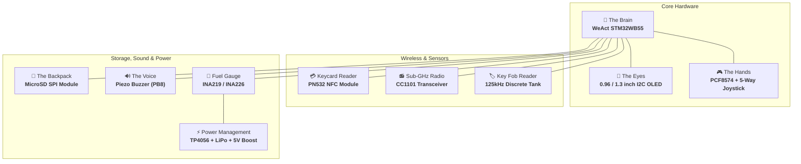
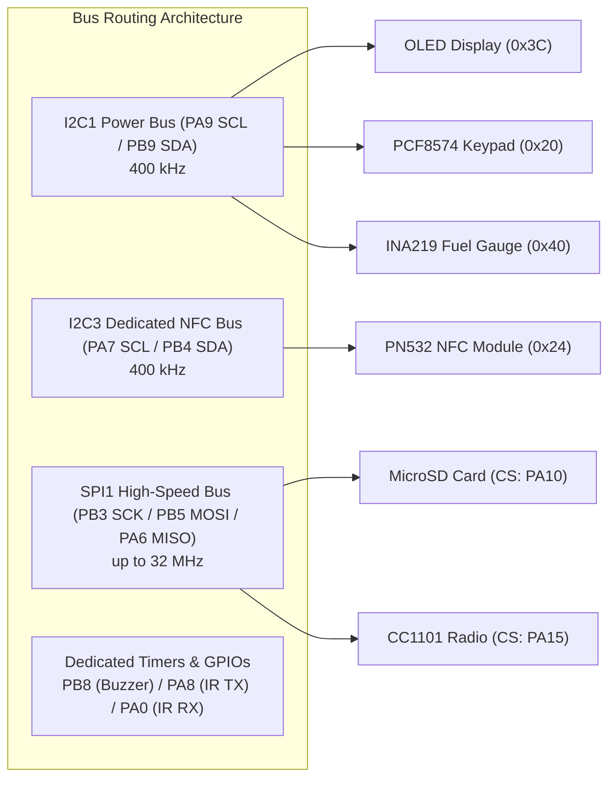
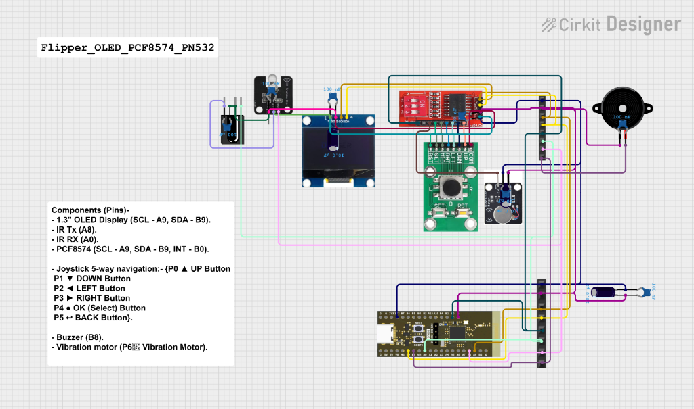
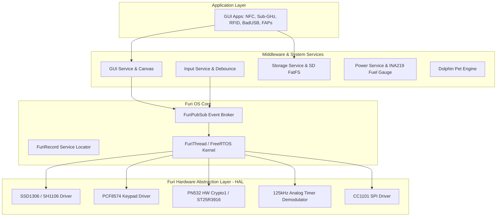
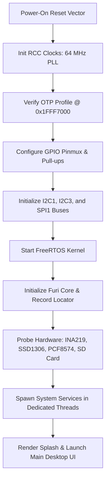
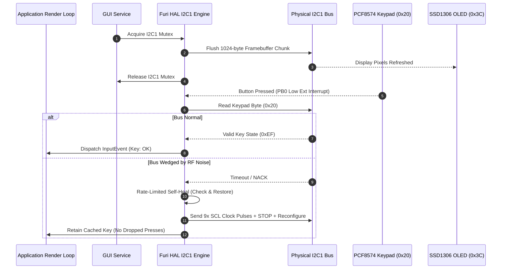
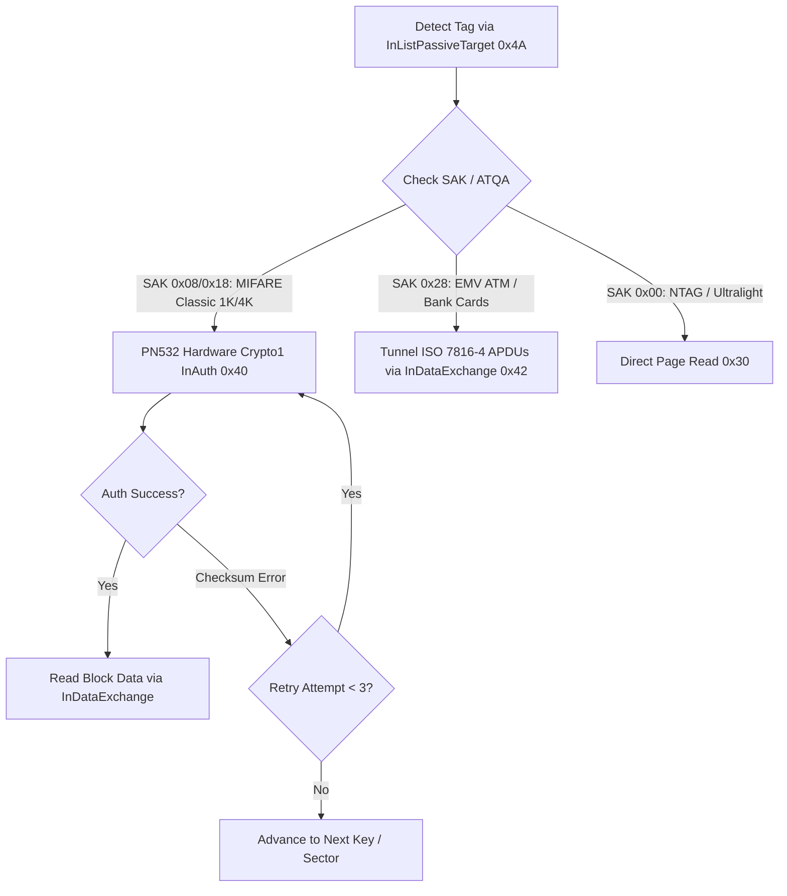

# 🐬 DIY Flipper Zero (OLED Edition)

**Maintainer**: [**AJ_60**](https://github.com/AJ60)  
**Repository**: [https://github.com/AJ60/Flipper_OLED_PCF8574_PN532](https://github.com/AJ60/Flipper_OLED_PCF8574_PN532)

---

> Build your own DIY Flipper Zero with an I2C OLED display, PCF8574 keypad, PN532 NFC reader, CC1101 sub-GHz radio, and discrete 125 kHz RFID hardware!

[](https://github.com/AJ60/Flipper_OLED_PCF8574_PN532/actions/workflows/build.yml)
[](https://github.com/AJ60/Flipper_OLED_PCF8574_PN532)
[](https://www.st.com/en/microcontrollers-microprocessors/stm32wb-series.html)
[](https://github.com/AJ60)
[](LICENSE)

> [!CAUTION]
> ⚖️ **LEGAL & EDUCATIONAL DISCLAIMER**:  
> This project and firmware are created strictly for **educational, academic research, and authorized security testing purposes only**. 
> - **DO NOT** use this firmware or hardware for unauthorized access, card cloning, or malicious activities.
> - The developers and contributors assume **no liability or responsibility** for any misuse, damage to property, or illegal actions committed using this software or hardware.

> [!WARNING]
> 🚧 **DEVELOPMENT STATUS NOTICE**:
> - **NFC Subsystem (PN532)**: **Under Active Development / Experimental.** Currently verified with **MIFARE Classic 1K/4K tags**, **NTAG series (NTAG213/215/216/Ultralight)**, and **EMV ATM / Bank payment cards** (ISO 14443-4 APDU reading).
> - **125 kHz LF-RFID Subsystem**: **Under Active Development / Experimental.** May contain bugs due to discrete analog hardware tolerances, coil inductance variance, and signal demodulation thresholds.

---

## 🧩 The Building Blocks (Hardware Modules)

Your DIY Flipper is built from standard, readily available breakout modules:




| # | Part | Nickname | What It Does (In Simple Words) |
|:---:|---|---|---|
| **1** | **WeAct STM32WB55** | 🧠 **The Brain** | Fast dual-core chip running Furi OS, FreeRTOS, games, and apps. |
| **2** | **SSD1306 / SH1106 OLED** | 👀 **The Eyes** | Shows animations, dolphin pet, menus, and frequency graphs (0.96" or 1.3"). |
| **3** | **PCF8574 Expander** | 🎮 **The Hands** | Connects 6 direction/action buttons + haptic vibration rumble motor. |
| **4** | **PN532 NFC Module** | 💳 **Keycard Reader** | Reads 13.56 MHz NFC (MIFARE Classic, NTAG, Bank Cards) on dedicated I2C3. |
| **5** | **CC1101 Radio** | 📻 **The Antenna** | Transmits and sniffs sub-GHz radio signals (gates, remotes, sensors). |
| **6** | **MicroSD Card Module** | 💾 **The Backpack** | Stores your saved keys, remotes, scripts, games, and animations. |
| **7** | **Passive Buzzer** | 🔊 **The Voice** | Plays fun 8-bit chimes, game sounds, and keypress clicks via timer PWM. |
| **8** | **INA219 / INA226** | 🔋 **Fuel Gauge** | High-side current/voltage sensor for battery curve & charging animations. |

---

## 🔌 Complete Wiring & Electrical Guide

Connecting the hardware is divided into four straightforward subsystems:



---

### Part 1: 🖼️ Core Subsystem (Cirkit Designer Schematic)

Follow the authoritative wiring schematic below for the core human-interface peripherals:



#### 📋 Core Subsystem Pin-to-Pin Table

| Component | Pin / Terminal | Connects to MCU / Destination | Wire Color (Diagram) | Function / Notes |
|---|---|---|:---:|---|
| **1.3" / 0.96" OLED** | `VCC` | **3.3V Rail** | 🔴 Red | Display Power (3.3V) |
| | `GND` | **GND Rail** | ⚫ Black | Ground |
| | `SCL` | **PA9** | 🟡 Yellow | I2C1 Clock (400 kHz) |
| | `SDA` | **PB9** | 🔵 Teal / Blue | I2C1 Data (400 kHz) |
| **PCF8574 I2C Expander** | `VCC` | **3.3V Rail** | 🔴 Red | Expander Power (3.3V) |
| | `GND` | **GND Rail** | ⚫ Black | Ground |
| | `SCL` | **PA9** | 🟡 Yellow | Shared I2C1 Clock |
| | `SDA` | **PB9** | 🔵 Teal / Blue | Shared I2C1 Data |
| | `INT` | **PB0** | 🟢 Dark Teal | Hardware Interrupt (`EXTI0`, active-low) |
| | `A0, A1, A2` | **GND** | — | Sets hardware I2C address to `0x20` |
| **5-Way Joystick & Buttons** | `UP` | **PCF8574 P0** | 🔵 Cyan | Up Navigation Button |
| | `DWN` | **PCF8574 P1** | 🟠 Orange | Down Navigation Button |
| | `LFT` | **PCF8574 P2** | 🟣 Purple | Left Navigation Button |
| | `RHT` | **PCF8574 P3** | 🟤 Brown | Right Navigation Button |
| | `MID` (Center Press)| **PCF8574 P4** | 🟢 Green | OK / Select Button |
| | `SET` / `RST` (Back) | **PCF8574 P5** | ⚪ Gray | Back Button |
| | `COM` | **GND Rail** | ⚫ Black | Common Ground (active-low switches) |
| **Vibration Motor Module** | `VCC` | **3.3V Rail** | 🔴 Red | Motor Power (via onboard driver) |
| | `GND` | **GND Rail** | ⚫ Black | Ground |
| | `IN` | **PCF8574 P6** | 🟣 Violet | Haptic Rumble Trigger (Active-High) |
| **Passive Piezo Buzzer** | Positive `+` | **PB8** | 🟣 Dark Purple | TIM16_CH1 Hardware Audio PWM |
| | Negative `-` | **GND Rail** | ⚫ Black | Ground Return |
| **IR Transmitter (TX)** | `VCC` | **3.3V / 5V Rail** | 🔴 Red | Transmitter Power |
| | `GND` | **GND Rail** | ⚫ Black | Ground |
| | `SIG / IN` | **PA8** | 🌸 Light Pink | TIM1_CH1 38 kHz Modulated Carrier |
| **IR Receiver (RX)** | `VCC` | **3.3V Rail** | 🔴 Red | 38 kHz TSOP Receiver Power |
| | `GND` | **GND Rail** | ⚫ Black | Ground |
| | `OUT / DATA` | **PA0** | 🟣 Purple | TIM2_CH1 Demodulated Signal Input |
| **Decoupling Capacitors** | `10 µF` (Electrolytic) | **3.3V ➔ GND** | — | Bulk Power Rail Filter (absorbs current spikes) |
| | `100 nF` (Ceramic) | Across VCC/GND of each module | — | High-frequency noise suppression |

> [!IMPORTANT]
> **I2C Pull-Up Resistors**: Standard I2C OLED boards have onboard 4.7 kΩ pull-up resistors on SDA/SCL. Keep the OLED connected so the I2C1 bus stays pulled up during boot!

---

### Part 2: 📻 Wireless, NFC & Storage Subsystem

The MicroSD card and CC1101 sub-GHz radio share the high-speed **SPI1** bus, while the PN532 NFC reader is isolated on hardware **I2C3** to prevent bus contention:

| Module | Module Pin | Connects to MCU Pin | Purpose / Notes |
|---|---|---|---|
| **Shared SPI1 Clock** | `SCK` | **PB3** | SPI1 Clock |
| **Shared SPI1 MOSI** | `MOSI` | **PB5** | Data Out from MCU |
| **Shared SPI1 MISO** | `MISO` | **PA6** | Data In to MCU |
| **MicroSD Card** | `CS` | **PA10** | SD Card Chip Select (Active-Low) |
| | `CD` (Detect) | *Not Connected (NC)* | Optional (firmware detects automatically) |
| **CC1101 Sub-GHz Radio**| `CSN / CS` | **PA15** | Radio Chip Select (Active-Low) |
| | `GDO0 / G0` | **PA1** | Radio Demodulated Data IRQ |
| | `VCC` / `GND` | **3.3V** / **GND** | **3.3V only!** (5V will permanently burn the CC1101) |
| **PN532 NFC Module** | `SCL` | **PA7** (Header "C0") | Dedicated I2C3 Clock (400 kHz) |
| | `SDA` | **PB4** (Header "C1") | Dedicated I2C3 Data (400 kHz) |
| | `IRQ` | **PA2** | Card Detection Interrupt (`EXTI2`, Active-Low) |
| **1-Wire / iButton** | `Data` | **PA3** | Dallas iButton probe with external 4.7 kΩ pull-up |
| **LF-RFID (125 kHz)** | Carrier TX | **PA5** | TIM2_CH1 coil push-pull driver stage *(Experimental)* |
| | Envelope RX | **PA1** | TIM1_CH1 demodulated envelope input *(Experimental)* |
| | Emulate | **PA2** | TIM2_CH3 tag emulation pulse switch *(Experimental)* |

---

### Part 3: ⚡ Battery & Power Management Subsystem

To ensure accurate battery percentage curves and trigger the Flipper OS **charging lightning bolt animation**, the INA219 sensor must sit on the **battery side (3.0V – 4.2V)**, *before* the 5V boost converter:

```text
    [ USB-C 5V Input ]
               │
    ┌──────────▼──────────┐
    │     TP4056 Board    │
    │  B+   B-  OUT+ OUT- │
    └──┬────┬────┬────┬───┘
       │    │    │    │
       │    │    │    └───────────────┬───────────────────────────► Common GND
       │    │    │                    │
       │  ┌─┴────┴───────┐            │
       │  │ 3.7V Battery │            │
       │  │  (+)     (-) │            │
       │  └──┬───────────┘            │
       │     │                        │
       └─────┼────────────┐           │
             │            │           │
          ┌──▼────────────▼───┐       │
          │      INA219       │       │
          │  Vin+        Vin- │       │
          │ 3.3V GND SCL  SDA │       │
          └───┬───┬───┬────┬──┘       │
              │   │   │    │          │
              │   └───┼────┼──────────┤ (Common GND)
              │       │    │          │
              │       │    │  [Power Switch]
              │       │    │        / 
              │       │    └───►[ ]── / ──[ ]
              │       │           (ON/OFF)  │
              │       │                     │
              │       │       ┌─────────────▼─────────┐
              │       │       │ Mini Boost Converter  │
              │       │       │ VIN  GND   GND   OUT  │
              │       │       └──┬────┬─────┬─────┬───┘
              │       │          │    │     │     │ (Regulated 5.0V)
              │       │          │    └─────┴─────┼───────────────► Common GND
              │       │          │                │
              │       │          │                └───────────────┐
              │       │          │                                │
  ┌───────────▼───────┼──────────┼────────────────────────────────┼────────┐
  │  3.3V            PA9        PB9                              5V   GND  │
  │ (Logic Out)     (SCL)       (SDA)                         (Power In)    │
  │                                                                        │
  │                       WeAct STM32WB55CGU6 Board                        │
  └────────────────────────────────────────────────────────────────────────┘
```

#### 📋 Power Chain Connection Table

| From Component & Pin | To Component & Pin | Wire Color | Voltage | Role / Notes |
|---|---|:---:|:---:|---|
| **Battery (+)** | **INA219 `Vin+`** & **TP4056 `B+`** | 🔴 Red | 3.0V – 4.2V | Cell positive terminal |
| **Battery (-)** | **TP4056 `B-`** | ⚫ Black | 0V | Protected negative terminal |
| **TP4056 `OUT+`** | **INA219 `Vin-`** | 🔴 Red | 3.0V – 4.2V | Charger output rail |
| **TP4056 `OUT-`** | **Common Ground (`GND`)** | ⚫ Black | 0V | System ground return |
| **INA219 `Vin-`** | **Power Switch (Terminal 1)** | 🔴 Red | 3.0V – 4.2V | Unswitched raw battery power |
| **Power Switch (Terminal 2)** | **Boost Converter `VIN`** | 🔴 Red | 3.0V – 4.2V | Switched battery power into boost |
| **Boost Converter `OUT`** | **WeAct `5V` (or `VBUS`)** | 🔴 Red | **5.0V DC** | Clean 5.0V into WeAct onboard LDO |
| **INA219 `VCC`** / `GND` | **WeAct `3.3V`** / `GND` | 🔴 / ⚫ | 3.3V / 0V | Sensor logic power & ground |
| **INA219 `SCL`** / `SDA` | **WeAct `PA9`** / `PB9` | 🟡 / 🔵 | 3.3V I2C | `I2C1` fuel gauge telemetry |

---

### Part 4: 🎮 Keypad & 5-Way Joystick Mapping

The buttons operate in an **active-low** configuration (pressing connects the pin to **GND**). The PCF8574 weak internal pull-up holds released pins `HIGH`:

```text
                 ┌───────────────┐
                 │    ▲ UP (P0)  │
                 └───────┬───────┘
                         │
       ┌──────────────┐  │  ┌──────────────┐
       │ ◄ LEFT (P2)  ├──┼──┤ RIGHT ► (P3) │
       └──────────────┘  │  └──────────────┘
                         │
                 ┌───────┴───────┐
                 │  ● OK (P4)    │
                 ├───────────────┤
                 │   ▼ DOWN (P1) │
                 └───────────────┘

       ┌──────────────┐     ┌──────────────┐
       │ ↩ BACK (P5)  │     │ 📳 VIBRO (P6)│
       └──────────────┘     └──────────────┘
```

* **P0** ➔ Up Button
* **P1** ➔ Down Button
* **P2** ➔ Left Button
* **P3** ➔ Right Button
* **P4** ➔ OK (Select) Button *(Joystick Center Press)*
* **P5** ➔ Back Button *(SET or RST switch)*
* **P6** ➔ Vibration Motor *(Driven through N-MOSFET / NPN transistor with 1N4148 flyback diode; never connect motor directly to pin!)*

---

## 🚀 4-Step Quick Start: Flashing the Device


### Step 1: Connect your modules
Wire your OLED screen, buttons, and MCU according to the visual wiring diagram above.

### Step 2: Configure OTP Memory (One-Time Only)
1. Open **`generate_otp_gui.exe`** (in [`mics/FlipperOTP/`](mics/FlipperOTP/)).
2. Set **Device Name** (e.g. `Flipper`), **Board Version: 12** *(WeAct STM32WB55)*, and **Display Type: MGG** *(Required for OLED)*.
3. Put the board into **DFU mode**: hold physical **BOOT0** on the WeAct board, plug in USB, and release BOOT0.
4. Click **"2. Flash (DFU)"** in the app.

---

### Step 3: Flash Firmware via qFlipper (1-Click Install)

#### For First-Time Setup:
1. Put the board into **DFU mode** (hold `BOOT0`, plug in USB, release `BOOT0`).
2. Open official **qFlipper** on your PC.
3. qFlipper will display **"RECOVERY MODE"**. Click **"REPAIR"** to flash the official bootloader.
4. Put the board back into **DFU mode** once more.
5. In qFlipper, click **"Install from file"** and select our **`.tgz`** release package from [Releases](https://github.com/AJ60/Flipper_OLED_PCF8574_PN532/releases).
6. qFlipper will flash the firmware, turn on the OLED screen, and copy all game/app assets to your microSD card!

> [!NOTE]
> **Black Screen During Update is Normal**: The standalone updater payload only contains drivers for the factory SPI screen. During installation, the screen stays off. Wait until qFlipper shows **"Update Successful!"** and the device will boot into the full OS.

---

## 🛠️ How to Build from Source (For Developers)

Use the built-in FBT build tool to compile locally:

```bash
# Windows (Command Prompt / PowerShell)
cmd /c fbt.cmd

# Linux / macOS
./fbt

# Build the complete qFlipper .tgz installer bundle & SDK
cmd /c fbt.cmd --with-updater updater_package
```

Compiled binaries are output to `build/f7-firmware-C/` and `dist/f7-C/`.

---

## 📐 Engineering Architecture & Waterfall Diagrams

### 1. 🏗️ Multi-Layer System Stack



---

### 2. 🌊 System Startup & Initialization Waterfall



---

### 3. 🔄 I2C Bus Arbitration & Rate-Limited Self-Healing



---

### 4. ⚡ PN532 Hardware Crypto1 & ISO 14443-4 Protocol Flow



---

### 📚 Deep-Dive Documentation Index
* 🏛️ [**System & Firmware Architecture Guide**](documentation/ARCHITECTURE.md) — FreeRTOS task scheduling, memory maps, and Furi OS primitives.
* 🌊 [**Firmware Boot & System Lifecycle Guide**](documentation/BOOT_AND_LIFECYCLE.md) — Waterfall boot sequence, OTP validation, bus recovery, and sleep/wake state machines.
* ⚡ [**PN532 NFC Protocol & Hardware Acceleration Guide**](documentation/NFC_PN532_ENGINEERING.md) — Hardware Crypto1 acceleration, ISO 14443-4 APDU tunneling for bank cards, and retry mechanisms.
* 📐 [**Hardware & Electrical Engineering Guide**](documentation/HARDWARE_DESIGN.md) — Complete schematic analysis, I2C pull-up calculations, and decoupling guidelines.
* ❓ [**FAQ & Troubleshooting Guide**](faq_diy_flipper.md) — Common boot issues, I2C freeze recovery, CC1101 calibration, and power troubleshooting.

---

## 📐 LF-RFID Discrete Analog Subsystem

The LF-RFID 125 kHz subsystem operates using discrete analog components:

* 📄 **LF-RFID PDF Schematic**: [Download 125kHz Subsystem Schematic (PDF)](misc/rfid_lf.pdf)

<details>
<summary><b>🔍 View LF-RFID Component Bill of Materials (BOM)</b></summary>

| Stage | Component | Value / Part | Description |
|---|---|---|---|
| **Transmitter Driver** | `PA5` (PWM) | MCU `TIM2_CH1` | 125 kHz Carrier PWM Drive |
| | `Q1` | BC337 / S8050 / 2N2222 | NPN Push-Pull Transistor |
| | `Q2` | BC327 / S8550 / 2N2907 | PNP Push-Pull Transistor |
| | `C1` | 2.2 nF | Drive Coupling Capacitor |
| **Resonant Tank** | `L1` | 1.2 mH / 95T | Antenna Coil |
| | `PA2` (Emulate) | MCU `TIM2_CH3` | Emulation Pulse Driver (`R2` 1k, `R8` 10k) |
| | `Q3` | 2N2222 | Emulation Switch Transistor (`R1` 100 Ohm) |
| **Demodulator** | `D1` | 1N4148 / BAT54S | Envelope Schottky Diode |
| | `C3`, `R3` | 1 nF, 10 kOhm | RC Low-Pass Filter |
| | `C4`, `R4` | 22 nF, 10 kOhm | AC Coupling Stage |
| | `U1` | LM2904 / LM358 / MCP6002 | Op-Amp Signal Amplifier (`R5`-`R7` 100k, `R9` 50k) |
| | `PA1` (Data In) | MCU `TIM1_CH1` | Demodulated RX Envelope Input |

</details>

---

## 🤝 Credits and Maintainer

* **Maintainer & Developer**: [**AJ_60**](https://github.com/AJ60)
* **Design & Code Contributors**: Nucleus Dark, Lamtran, artema0g, and the Flipper Zero / Momentum community.
* **License**: Open-source under the [GNU General Public License v3.0](LICENSE).
