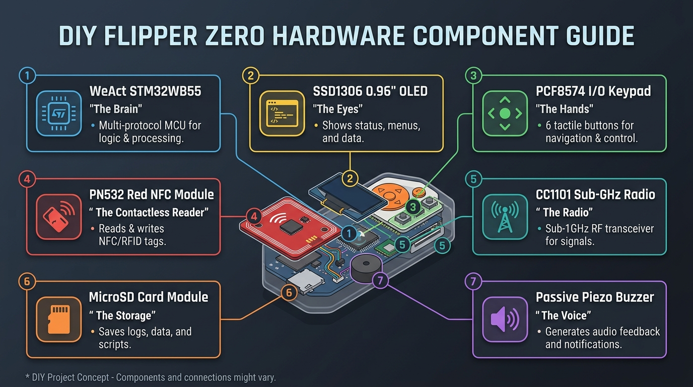
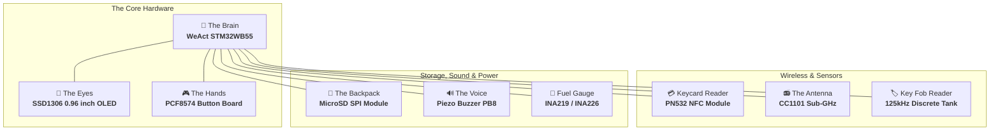
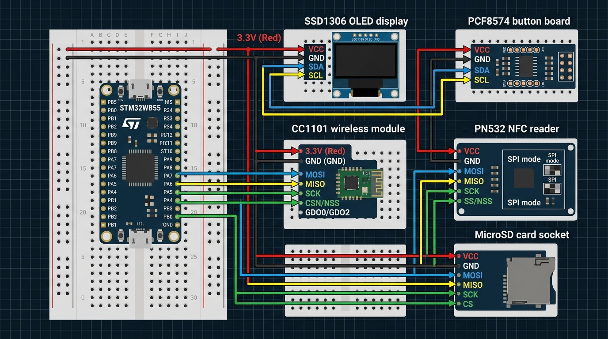
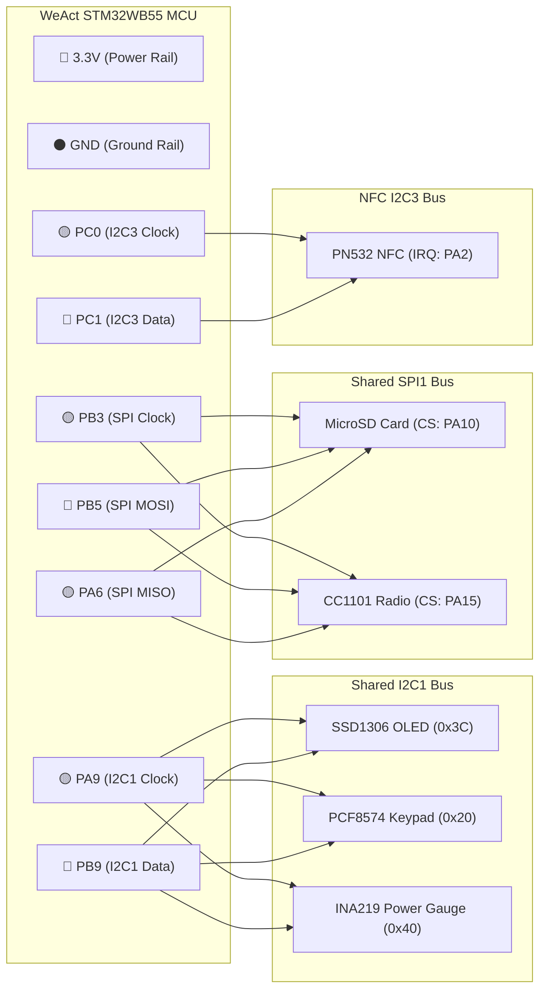
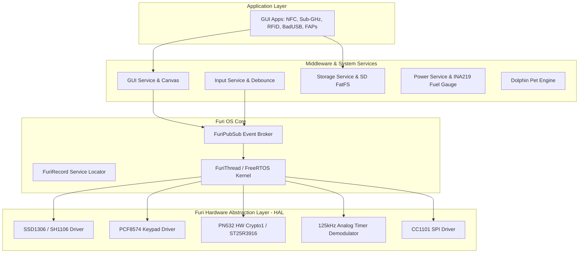
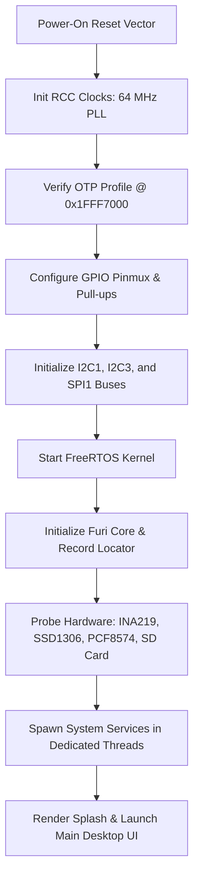
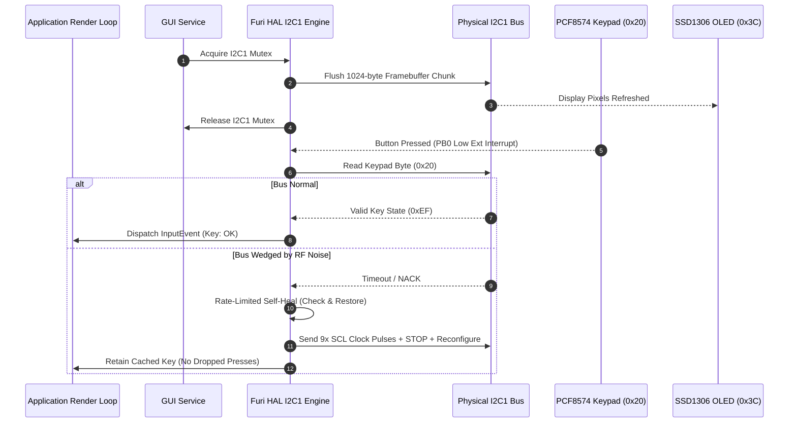
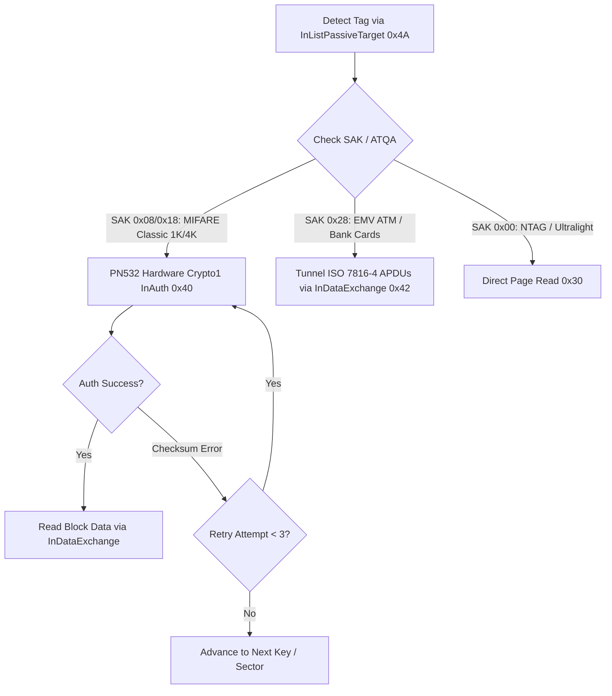

# 🐬 DIY Flipper Zero (OLED Edition)

> Build your own DIY Flipper Zero with an I2C OLED display, PCF8574 keypad, PN532 NFC reader, and discrete sub-GHz / 125kHz RFID hardware!

[](https://github.com/AJ60/oled_flipper)
[](https://www.st.com/en/microcontrollers-microprocessors/stm32wb-series.html)
[](https://github.com/AJ60)
[](LICENSE)

> [!CAUTION]
> ⚖️ **LEGAL & EDUCATIONAL DISCLAIMER**:
> This project and firmware are created strictly for **educational, academic research, and authorized security testing purposes only**. 
> - **DO NOT** use this firmware or hardware for any unauthorized access, card cloning, or malicious activities.
> - The developers and contributors assume **no liability or responsibility** for any misuse, damage to property, or illegal actions committed using this software or hardware.

> [!WARNING]
> 🚧 **DEVELOPMENT STATUS NOTICE**:
> - **NFC Subsystem (PN532)**: **Under Active Development / Experimental.** Currently tested and verified only with **MIFARE Classic 1K tags**, **NTAG series (NTAG213/215/216/Ultralight)**, and **EMV ATM / Bank payment cards** (ISO 14443-4 APDU reading). Other NFC standards and card types may behave unpredictably.
> - **125 kHz LF-RFID Subsystem**: **Under Active Development / Experimental.** May contain bugs due to discrete analog hardware tolerances, coil inductance variance, and signal demodulation thresholds.

---

## 🧩 The Building Blocks (Hardware Modules)

Think of your DIY Flipper as a friendly little robot made of modular building blocks:





| # | Part | Nickname | What It Does (In Simple Words) |
|---|---|---|---|
| **1** | **WeAct STM32WB55** | 🧠 **The Brain** | Fast dual-core chip that runs the operating system, games, and apps. |
| **2** | **SSD1306 0.96" OLED** | 👀 **The Eyes** | Shows animations, dolphin pet, menus, and signal frequencies. |
| **3** | **PCF8574 Expander** | 🎮 **The Hands** | Connects 6 direction/action buttons + haptic vibration rumble. |
| **4** | **PN532 NFC Module** | 💳 **Keycard Reader** | Reads 13.56 MHz NFC (MIFARE Classic 1K, NTAG, Bank Cards). |
| **5** | **CC1101 Radio** | 📻 **The Antenna** | Transmits and catches sub-GHz radio signals (gates, remotes, sensors). |
| **6** | **MicroSD Card Module** | 💾 **The Backpack** | Stores your saved keys, remotes, scripts, games, and animations. |
| **7** | **Passive Buzzer** | 🔊 **The Voice** | Plays fun 8-bit chimes, game sounds, and keypress clicks. |
| **8** | **INA219 / INA226** | 🔋 **Fuel Gauge** | Monitors battery voltage and charging percentage accurately. |

---

## 🔌 Easy Visual Wiring Guide (Breadboard Style)

Connecting the modules is just like snapping together color-coded blocks. Follow the wiring visual and connection map below:





### 🎨 Wire Color Rule:
* 🔴 **Red** = Power (`3.3V`)
* ⚫ **Black** = Ground (`GND`)
* 🔵 **Blue** = Data line (`SDA` / `MOSI`)
* 🟡 **Yellow** = Clock line (`SCL` / `SCK` / `MISO`)
* 🟢 **Green** = Control signal (`CS` / `INT` / `IRQ`)

---

### 📋 Pin-to-Pin Connection Table

#### 1. I2C Bus Devices (Screen, Keypad & Power Monitor)
All 3 modules share the same two clock & data pins:

| Module Pin | Connects to MCU Pin | Wire Color | Purpose |
|---|---|---|---|
| **VCC** (All 3 modules) | **3.3V** | 🔴 Red | Power |
| **GND** (All 3 modules) | **GND** | ⚫ Black | Ground |
| **SCL** (All 3 modules) | **PA9** | 🟡 Yellow | I2C Clock |
| **SDA** (All 3 modules) | **PB9** | 🔵 Blue | I2C Data |
| **PCF8574 INT** | **PB0** | 🟢 Green | Button Press Wakeup Signal |
| **INA219/226 ALERT** | **PB1** | 🟢 Green | Low Battery / Overcurrent Alert |

> [!IMPORTANT]
> **I2C Pull-Up Resistors**: The OLED screen board has built-in 4.7 kΩ pull-up resistors on SDA/SCL. Keep the OLED connected so the I2C bus stays stable during boot!

---

#### 2. SPI & External Bus Devices (SD Card, CC1101 Radio & NFC)

| Module | Module Pin | Connects to MCU Pin | Purpose |
|---|---|---|---|
| **Shared Clock** | `SCK` | **PB3** | SPI Clock |
| **Shared MOSI** | `MOSI` | **PB5** | Data Out from MCU |
| **Shared MISO** | `MISO` | **PA6** | Data In to MCU |
| **MicroSD Card** | `CS` | **PA10** | SD Card Select |
| **CC1101 Radio** | `CSN / CS` | **PA15** | Radio Select |
| | `GDO0 / G0` | **PA1** | Radio IRQ Signal |
| **PN532 NFC (I2C3)** | `SCL` / `SDA` | **PC0** / **PC1** | NFC I2C Bus 3 |
| | `IRQ` | **PA2** | NFC Card Detect IRQ |
| **ST25R3916 (SPI)** | `CS` | **PE4** | SPI NFC Select (Alternative) |

---

#### 3. Other Peripherals (Buzzer, IR & 125kHz RFID)

| Feature | Component Pin | Connects to MCU Pin | Note |
|---|---|---|---|
| 🔊 **Speaker / Buzzer** | Positive `+` | **PB8** (TIM16) | Connect negative `-` to GND |
| 🔴 **IR Receiver** | `DATA` | **PA0** | 38 kHz TSOP receiver |
| 💡 **IR Transmitter** | `LED Anode` | **PA8** | High-power IR LED (via NPN transistor) |
| 🏷️ **1-Wire / iButton** | `Data` | **PA3** | Dallas iButton probe with 4.7k pull-up |
| 📻 **LF-RFID (125 kHz)** | Carrier TX | **PA5** (TIM2_CH1) | Coil driver push-pull stage *(Experimental)* |
| | Envelope RX | **PA1** (TIM1_CH1) | Demodulated envelope input *(Experimental)* |
| | Emulate | **PA2** (TIM2_CH3) | Tag emulation pulse switch *(Experimental)* |

---

## 🎮 Button Mapping Guide (PCF8574 Keypad)

Buttons are wired to the PCF8574 board in an **active-low** configuration (pressing a button connects the pin to **GND**):

```text
                 ┌───────────────┐
                 │    ▲ UP (P0)  │
                 └───────┬───────┘
                         │
       ┌──────────────┐  │  ┌──────────────┐
       │ ◄ LEFT (P2)  ├──┼──┤ RIGHT ► (P3) │
       └──────────────┘  │  └──────────────┘
                         │
                 ┌───────┴───────┐
                 │  ● OK (P4)    │
                 ├───────────────┤
                 │   ▼ DOWN (P1) │
                 └───────────────┘

       ┌──────────────┐     ┌──────────────┐
       │ ↩ BACK (P5)  │     │ 📳 VIBRO(P6) │
       └──────────────┘     └──────────────┘
```

* **P0** ➔ Up Button
* **P1** ➔ Down Button
* **P2** ➔ Left Button
* **P3** ➔ Right Button
* **P4** ➔ OK (Select) Button
* **P5** ➔ Back Button
* **P6** ➔ Vibration Motor (driven through an N-channel MOSFET; do not connect motor directly to pin!)

---

## 🚀 4-Step Quick Start: Flashing the Device


### Step 1: Connect your modules
Connect your OLED screen, buttons, and MCU according to the wiring diagram.

### Step 2: Configure OTP Memory (Only Once)
1. Open **`generate_otp_gui.exe`** (in the [`mics/FlipperOTP/`](mics/FlipperOTP/) folder).
2. Set **Device Name** (e.g. `Flipper`), **Board Version** (`12` for WeAct STM32WB55), and **Display Type: MGG** *(required for OLED)*.
3. Put the board into **DFU mode**: hold the physical **BOOT0** button on the WeAct board, plug in the USB cable, and release BOOT0.
4. Click **"2. Flash (DFU)"** in the app.

---

### Step 3: Flash Firmware via qFlipper (1-Click Install)

#### For First-Time Setup:
1. Put the board in **DFU mode** (hold `BOOT0`, plug in USB, release `BOOT0`).
2. Open the official **qFlipper** application on your PC.
3. qFlipper will show **"RECOVERY MODE"**. Click **"REPAIR"** to install the bootloader.
4. Put the board back into **DFU mode** once more.
5. Click **"Install from file"** in qFlipper and select our **`.tgz`** firmware package from the [Releases](https://github.com/AJ60/oled_flipper/releases) page.
6. qFlipper will flash the firmware, turn on the OLED screen, and automatically copy all required game/app resource files to your microSD card!

#### For Normal Updates:
Connect the DIY Flipper via USB, open **qFlipper**, click **"Install from file"**, and select the updated **`.tgz`** package.

---

## 🛠️ How to Build from Source (For Developers)

Use the built-in FBT build system to compile the firmware locally:

```bash
# Windows (Command Prompt / PowerShell)
cmd /c fbt.cmd

# Linux / macOS
./fbt

# Build the complete qFlipper .tgz installer bundle & SDK
cmd /c fbt.cmd --with-updater updater_package
```

Compiled binaries land in `build/f7-firmware-C/` and `dist/f7-C/`.

---

## 📐 Engineering Architecture & Waterfall Diagrams

### 1. 🏗️ Multi-Layer System Stack



---

### 2. 🌊 System Startup & Initialization Waterfall



---

### 3. 🔄 I2C Bus Arbitration & Rate-Limited Self-Healing Waterfall



---

### 4. ⚡ PN532 Hardware Crypto1 & ISO 14443-4 APDU Protocol Flow



---

### 📚 Deep-Dive Engineering Documentation:
* 🏛️ [**System & Firmware Architecture Guide**](documentation/ARCHITECTURE.md) — FreeRTOS task scheduling, memory maps, IPCC dual-core mailbox, and Furi OS primitives.
* 🌊 [**Firmware Boot & System Lifecycle Guide**](documentation/BOOT_AND_LIFECYCLE.md) — Step-by-step waterfall sequence, OTP validation, bus recovery, and sleep/wake state machines.
* ⚡ [**PN532 NFC Protocol & Hardware Acceleration Guide**](documentation/NFC_PN532_ENGINEERING.md) — Hardware Crypto1 authentication, ISO 14443-4 APDU tunneling for bank cards, and checksum error retries.
* 📐 [**Hardware & Electrical Engineering Guide**](documentation/HARDWARE_DESIGN.md) — Schematic analysis, I2C pull-up calculations, 125kHz analog tank tuning, and power decoupling.

---

## 📐 LF-RFID Discrete Analog Subsystem

The LF-RFID 125 kHz subsystem operates using discrete analog components:

* 📄 **LF-RFID PDF Schematic**: [Download 125kHz Subsystem Schematic (PDF)](misc/rfid_lf.pdf)

> [!WARNING]
> The 125 kHz analog circuit is sensitive to component tolerances (coil inductance, capacitor values, and diode forward voltage). It is provided for **educational experimentation** and may require fine-tuning on breadboards.

<details>
<summary><b>🔍 View LF-RFID Component Bill of Materials (BOM)</b></summary>

| Stage | Component | Value / Part | Description |
|---|---|---|---|
| **Transmitter Driver** | `PA5` (PWM) | MCU `TIM2_CH1` | 125 kHz Carrier PWM Drive |
| | `Q1` | BC337 / S8050 / 2N2222 | NPN Push-Pull Transistor |
| | `Q2` | BC327 / S8550 / 2N2907 | PNP Push-Pull Transistor |
| | `C1` | 2.2 nF | Drive Coupling Capacitor |
| **Resonant Tank** | `L1` | 1.2 mH / 95T | Antenna Coil |
| | `PA2` (Emulate) | MCU `TIM2_CH3` | Emulation Pulse Driver (`R2` 1k, `R8` 10k) |
| | `Q3` | 2N2222 | Emulation Switch Transistor (`R1` 100 Ohm) |
| **Demodulator** | `D1` | 1N4148 / BAT54S | Envelope Schottky Diode |
| | `C3`, `R3` | 1 nF, 10 kOhm | RC Low-Pass Filter |
| | `C4`, `R4` | 22 nF, 10 kOhm | AC Coupling Stage |
| | `U1` | LM2904 / LM358 / MCP6002 | Op-Amp Signal Amplifier (`R5`-`R7` 100k, `R9` 50k) |
| | `PA1` (Data In) | MCU `TIM1_CH1` | Demodulated RX Envelope Input |

</details>

---

## 🤝 Credits and Maintainer

* **Maintainer & Developer**: [**AJ_60**](https://github.com/AJ60)
* **Design & Code Contributors**: Nucleus Dark, Lamtran, artema0g, and the Flipper Zero / Momentum community.
* **License**: Open-source under the [GNU General Public License v3.0](LICENSE).
