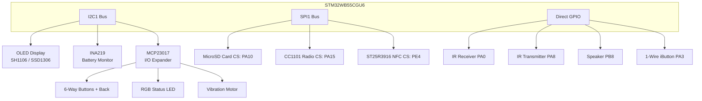

# ⚙️ DIY Flipper Zero (OLED Version)
Custom firmware fork supporting standard I2C OLED screens (SH1106 and SSD1306) on DIY Flipper hardware.

[](https://github.com/artema0g/oled_flipper)
[](https://www.st.com/en/microcontrollers-microprocessors/stm32wb-series.html)
[](https://ko-fi.com/artema0g)
[](LICENSE)

> [!WARNING]
> I do not take responsibility if you damage your board or property. This guide is for educational purposes only — proceed at your own risk.

> [!TIP]
> ❓ Need help or have questions about building/flashing the DIY Flipper? 
> Join our community Q&A and troubleshooting discussion: **[GitHub Q&A Discussion #4](https://github.com/artema0g/oled_flipper/discussions/4)**

---

## <a id="hardware-showcase"></a>📷 Hardware Showcase

Here is the physical DIY board in action:

<p align="center">
  
  
</p>

---

## <a id="table-of-contents"></a>📚 Table of Contents
- [Summary](#summary)
- [System Architecture](#system-architecture)
- [What Works and Limitations](#what-works-and-limitations)
- [Key Pins and Wiring](#key-pins-and-wiring)
- [MCP23017 Wiring Guide](#mcp23017-wiring-guide)
- [How to Build and Flash](#how-to-build-and-flash)
- [Schematic](#schematic)
- [Credits and Support](#credits-and-support)

---

## <a id="summary"></a>🔍 Summary
This project implements a custom target for a DIY Flipper-style board based on the **WeAct STM32WB55CGU6** board. It integrates the following components:

*   **Display**: I2C OLED display (SH1106 / SSD1306)
*   **Sensors**: INA219 battery monitor (I2C)
*   **I/O Expander**: MCP23017 (handles buttons, RGB LED, and vibration motor)
*   **Storage**: microSD slot (SPI)
*   **Radio**: CC1101 sub-GHz module (SPI)
*   **NFC**: ST25R3916 Elechouse module (SPI)
*   **Peripherals**: Speaker/buzzer, IR transmitter/receiver, vibration motor

---

## <a id="system-architecture"></a>📐 System Architecture

This diagram visualizes how the different components interface with the STM32WB55 MCU over I2C, SPI, and GPIO.



---

## <a id="what-works-and-limitations"></a>✅ What Works and Limitations
*   **Core Systems**: All official Flipper firmware features compile and function.
*   **I2C Devices**: OLED, INA219, and MCP23017 are multiplexed onto the primary I2C1 bus to preserve SPI resources.
*   **NFC Support**: Verified working with Elechouse ST25R3916 modules.
*   **Sub-GHz**: CC1101 module tested and fully functional.

---

## <a id="key-pins-and-wiring"></a>📌 Key Pins and Wiring

| Component | Bus / Interface | MCU pin (macro) | Notes |
|---|---|---|---|
| **I2C1 (Power/Default)** | I2C | SCL: PA9, SDA: PB9 | Used by INA219, MCP23017, and OLED |
| **I2C3 (External)** | I2C | SCL: PA7, SDA: PB4 | Reserved for external modules/sensors |
| **SPI1 (Shared)** | SPI | MOSI: PB5, SCK: PB3 | Shared SCK/MOSI bus for CC1101, NFC, and SD card |
| **CC1101** | SPI + IRQ | CS: PA15, MISO: PA6, G0: PA1 | Sub-GHz transceiver |
| **SD card** | SPI | CS: PA10, MISO: PA6 | MicroSD module |
| **NFC** | SPI | CS: PE4, MISO: PB4, IRQ: PA2 | Elechouse ST25R3916 reader (Uses dedicated MISO) |
| **MCP23017 Interrupt** | GPIO | INT: PB0 | Signals button state changes |
| **IR** | GPIO | RX: PA0, TX: PA8 | Safe IR transmitter & receiver |
| **Speaker** | PWM | PB8 (TIM16) | Sound buzzer |
| **iButton** | 1-Wire | PA3 | Dallas 1-Wire keys |

---

## <a id="mcp23017-wiring-guide"></a>🎛️ MCP23017 Wiring Guide

The MCP23017 handles all buttons, status LEDs, and haptic feedback. Connect them in an **active-low** configuration (connecting to GND when pressed/active).

*   **Port A (Button Inputs)**:
    *   `GPA0` -> Up Button
    *   `GPA1` -> Right Button
    *   `GPA2` -> OK Button
    *   `GPA3` -> Back Button
    *   `GPA4` -> Down Button
    *   `GPA5` -> Left Button
*   **Port B (Outputs)**:
    *   `GPB0` -> Haptic Vibration Motor (Use an N-channel MOSFET; do not drive directly!)
    *   `GPB1` -> RGB Red Channel
    *   `GPB2` -> RGB Green Channel
    *   `GPB3` -> RGB Blue Channel

---

## <a id="how-to-build-and-flash"></a>🛠️ How to Build and Flash

### 1. Build from Source
To compile the firmware for the OLED hardware target, use the Flipper Build Tool:
```bash
# Build the target DFU package
./fbt
```

### 2. Configure & Flash OTP (One-Time Programmable) Memory
> [!CAUTION]
> OTP memory can only be written **ONCE**. It cannot be erased or changed. Proceed at your own risk.

1. Open **`generate_otp_gui.exe`** (found in the [`mics/FlipperOTP/`](mics/FlipperOTP/) folder). No installation required.
2. Set your **Device Name** (max 8 ASCII characters) and **Board Version** (`12` for WeAct STM32WB55).
3. Select **Display Type: MGG** (Monochrome Glass Grid) — required for the SSD1306 OLED screen.
4. Put the MCU into **DFU mode**: hold `BOOT0`, connect USB, release `BOOT0`. The app status will show **🟢 Connected**.
5. Click **"2. Flash (DFU)"** — the tool writes OTP directly to `0x1FFF7000`.

> [!TIP]
> Alternatively, click **"1. Save .bin"** to generate the file, then flash it manually via [STM32CubeProgrammer](https://www.st.com/en/development-tools/stm32cubeprog.html).

### 3. Flash Firmware

Choose the appropriate method depending on whether you are setting up the board for the first time or just updating the firmware.

---

#### Method A: First-Time Setup (or after a Full Flash Erase)
*Use this method if the board is blank, has no bootloader, or was fully erased.*

1. Put the board in DFU mode (hold `BOOT0`, connect USB, release `BOOT0`).
2. Open the **qFlipper** desktop application.
3. qFlipper will detect the board and display **"RECOVERY MODE"** (or **"Update & Recovery Mode DFU started"**).
4. Click the **"REPAIR"** button. qFlipper will automatically restore the official bootloader and partition the internal Flash.
5. Once the recovery is complete, the screen might remain blank (since the official firmware lacks OLED drivers), but the device will now connect to qFlipper.
6. Now, put the board back into **DFU mode** again (so it doesn't freeze under the official firmware).
7. Click **"Install from file"** in qFlipper.
8. Choose your preferred update style:
   * **Using the `.tgz` package (Recommended):** Select the **`.tgz`** archive. qFlipper will flash the firmware (the OLED screen will turn on), reboot into normal mode, and then copy the required resource files to your SD card automatically.
   * **Using the `.dfu` file (Manual):** Select the **`.dfu`** firmware file to flash it (OLED turns on). After it boots, you will need to manually unzip the resources package and copy the files to the root of your microSD card.

---

#### Method B: Regular Firmware Updates
*Use this method to update an already working DIY Flipper.*

* **Using the `.tgz` package:** Connect the Flipper to your PC via USB, open **qFlipper**, click **"Install from file"**, and select the updated **`.tgz`** archive. qFlipper will automatically flash the MCU and update all SD card files in one go.
* **Using the `.dfu` file:** Put the board in **DFU mode**, open qFlipper, click **"Install from file"**, and select the updated **`.dfu`** firmware file.

---

#### Option C: Flashing via STM32CubeProgrammer / ST-Link (Advanced)
> [!WARNING]
> **DO NOT use "Full Chip Erase"** in STM32CubeProgrammer!
> Doing a full chip erase will wipe out the emulation OTP structures, flash partition tables, and calibration settings. If these are wiped, the firmware will freeze early during boot (leading to a blank screen and USB connection loss).
> 
> *   Set the Erase option to **"Sector Erase"** (only erase sectors occupied by the firmware).
> *   If you did a full chip erase by mistake, follow **Method A (First-Time Setup)** to rebuild the device partitions first.

---

## <a id="schematic"></a>🔌 Schematic

A complete wiring schematic is available in the repository. Refer to the image below for physical connections:


---

## <a id="credits-and-support"></a>🤝 Credits and Support

Special thanks to:
*   **Nucleus Dark** & **Lamtran** for their design inspiration and code contributions.

### ☕ Support this Project
If you find this project useful and would like to support its development, you can buy me a coffee here:
*   **Ko-fi**: [Support artema0g on Ko-fi](https://ko-fi.com/artema0g)
