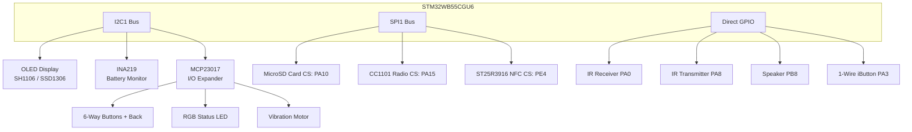
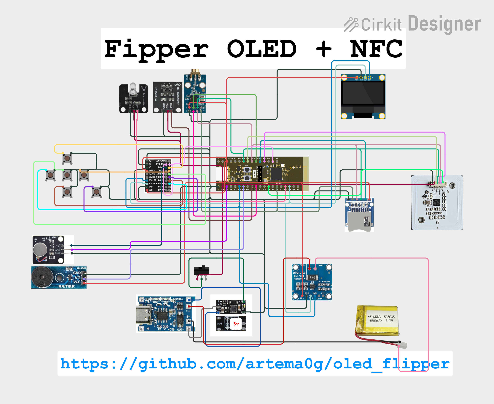

# ⚙️ DIY Flipper Zero (OLED Version)
Custom firmware fork supporting standard I2C OLED screens (SH1106 and SSD1306) on DIY Flipper hardware.

[](https://github.com/artema0g/oled_flipper)
[](https://www.st.com/en/microcontrollers-microprocessors/stm32wb-series.html)
[](https://ko-fi.com/artema0g)
[](LICENSE)

> [!WARNING]
> I do not take responsibility if you damage your board or property. This guide is for educational purposes only — proceed at your own risk.

---

## 📷 Hardware Showcase

Here is the physical DIY board in action:

<p align="center">
  
  
</p>

---

## 📚 Table of Contents
- [Summary](#summary)
- [System Architecture](#system-architecture)
- [What Works and Limitations](#what-works-and-limitations)
- [Key Pins and Wiring](#key-pins-and-wiring)
- [MCP23017 Wiring Guide](#mcp23017-wiring-guide)
- [How to Build and Flash](#how-to-build-and-flash)
- [Schematic](#schematic)
- [Credits and Support](#credits-and-support)

---

## 🔍 Summary
This project implements a custom target for a DIY Flipper-style board based on the **WeAct STM32WB55CGU6** board. It integrates the following components:

*   **Display**: I2C OLED display (SH1106 / SSD1306)
*   **Sensors**: INA219 battery monitor (I2C)
*   **I/O Expander**: MCP23017 (handles buttons, RGB LED, and vibration motor)
*   **Storage**: microSD slot (SPI)
*   **Radio**: CC1101 sub-GHz module (SPI)
*   **NFC**: ST25R3916 Elechouse module (SPI)
*   **Peripherals**: Speaker/buzzer, IR transmitter/receiver, vibration motor

---

## 📐 System Architecture

This diagram visualizes how the different components interface with the STM32WB55 MCU over I2C, SPI, and GPIO.



---

## ✅ What Works and Limitations
*   **Core Systems**: All official Flipper firmware features compile and function.
*   **I2C Devices**: OLED, INA219, and MCP23017 are multiplexed onto the primary I2C1 bus to preserve SPI resources.
*   **NFC Support**: Verified working with Elechouse ST25R3916 modules.
*   **Sub-GHz**: CC1101 module tested and fully functional.

---

## 📌 Key Pins and Wiring

| Component | Bus / Interface | MCU pin (macro) | Notes |
|---|---|---|---|
| **I2C1 (Power/Default)** | I2C | SCL: PA9, SDA: PB9 | Used by INA219, MCP23017, and OLED |
| **I2C3 (External)** | I2C | SCL: PA7, SDA: PB4 | Reserved for external modules/sensors |
| **SPI1 (Shared)** | SPI | MISO: PA6, MOSI: PB5, SCK: PB3 | Shared by CC1101, NFC, and SD card |
| **CC1101** | SPI + IRQ | CS: PA15, G0: PA1 | Sub-GHz transceiver |
| **SD card** | SPI | CS: PA10 | MicroSD module |
| **NFC** | SPI | CS: PE4, IRQ: PA2 | Elechouse ST25R3916 reader |
| **MCP23017 Interrupt** | GPIO | INT: PB0 | Signals button state changes |
| **IR** | GPIO | RX: PA0, TX: PA8 | Safe IR transmitter & receiver |
| **Speaker** | PWM | PB8 (TIM16) | Sound buzzer |
| **iButton** | 1-Wire | PA3 | Dallas 1-Wire keys |

---

## 🎛️ MCP23017 Wiring Guide

The MCP23017 handles all buttons, status LEDs, and haptic feedback. Connect them in an **active-low** configuration (connecting to GND when pressed/active).

*   **Port A (Button Inputs)**:
    *   `GPA0` -> Up Button
    *   `GPA1` -> Right Button
    *   `GPA2` -> OK Button
    *   `GPA3` -> Back Button
    *   `GPA4` -> Down Button
    *   `GPA5` -> Left Button
*   **Port B (Outputs)**:
    *   `GPB0` -> Haptic Vibration Motor (Use an N-channel MOSFET; do not drive directly!)
    *   `GPB1` -> RGB Red Channel
    *   `GPB2` -> RGB Green Channel
    *   `GPB3` -> RGB Blue Channel

---

## 🛠️ How to Build and Flash

### 1. Build from Source
To compile the firmware for the OLED hardware target, use the Flipper Build Tool:
```bash
# Build the target DFU package
./fbt
```

### 2. Configure OTP (One-Time Programmable) Memory
> [!CAUTION]
> Writing OTP is a one-time operation. Ensure all connections are secure.

1. Open the OTP utility `qFlipper OTP.exe` (found in the `mics/FlipperOTP/` folder).
2. Set configuration: Version 12 | Firmware 7 | Body 9 | Connection 6.
3. Select Display `mgg` (Monochrome Glass Grid). Generate and save the OTP file.
4. Put the MCU into DFU mode (hold `BOOT0` and connect to PC).
5. Open `STM32CubeProgrammer`, select `USB` mode, connect, load the OTP file, and write to `0x1FFF7000`.

### 3. Flash Firmware
1. Unplug the microSD card from your DIY board to prevent interference.
2. Put the board back in DFU mode, open `qFlipper`, and choose **Install from file**.
3. Select the generated `.dfu` file from the `build/` directory and flash.

---

## 🔌 Schematic

A complete wiring schematic is available in the repository. Refer to the image below for physical connections:



---

## 🤝 Credits and Support

Special thanks to:
*   **Nucleus Dark** & **Lamtran** for their design inspiration and code contributions.

### ☕ Support this Project
If you find this project useful and would like to support its development, you can buy me a coffee here:
*   **Ko-fi**: [Support artema0g on Ko-fi](https://ko-fi.com/artema0g)
