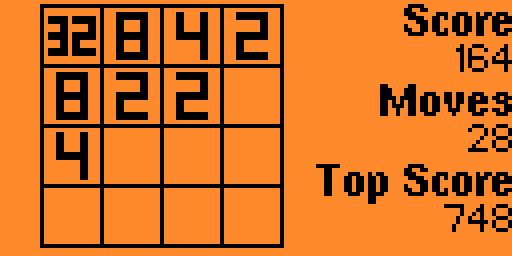

# "2048" game for Flipper Zero

**Maintainer**: [**AJ_60**](https://github.com/AJ60)  
**Repository**: [https://github.com/AJ60/Oled_PCF8574_PN532](https://github.com/AJ60/Oled_PCF8574_PN532)

---

- play up to 65K
- progress is saved on exit

#### TODO:
 - add animations
 
#### Thanks to:
 - [DroomOne's FlappyBird](https://github.com/DroomOne/flipperzero-firmware/tree/main/applications/flappy_bird)
 - [x27's "15" Game](https://github.com/x27/flipperzero-game15)

#### License
[MIT](LICENSE)
Copyright 2022 Eugene Kirzhanov
