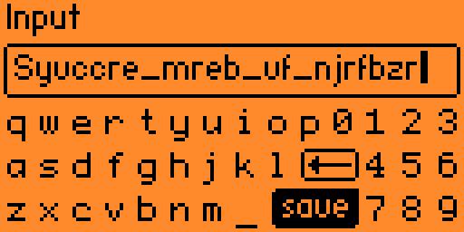
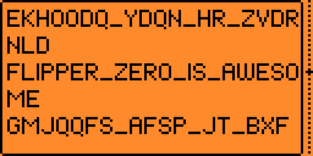

# Caesar Cipher

**Maintainer**: [**AJ_60**](https://github.com/AJ60)  
**Repository**: [https://github.com/AJ60/Oled_PCF8574_PN532](https://github.com/AJ60/Oled_PCF8574_PN532)

---


A [caesar cipher](https://en.wikipedia.org/wiki/Caesar_cipher) encoder for the Flipper Zero device.




## Usage

Start app, painfully input your ciphertext with the onscreen keyboard. Replace spaces with underscores. Hit "Save", scroll output.

## Compiling

```
./fbt firmware_caesar_cipher
```

