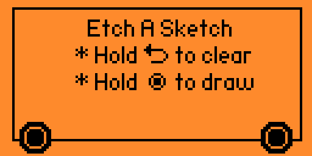

# FlipperZero-Etch-A-Sketch

**Maintainer**: [**AJ_60**](https://github.com/AJ60)  
**Repository**: [https://github.com/AJ60/Flipper_OLED_PCF8574_PN532](https://github.com/AJ60/Flipper_OLED_PCF8574_PN532)

---

Turn the Flipper Zero into an Etch A Sketch

This is a modification of the original paint app.

 ## Changes
 - LED indicator turns red when draw mode is enabled
 - Pressing and holding the DPad will continously draw
 - Vibration effects added for mechanical feedback
 - Audio cues added for feedback
 - Smaller brush size for more creativity