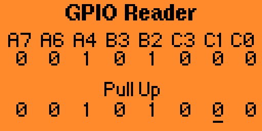

# flipperzero-gpioreader

**Maintainer**: [**AJ_60**](https://github.com/AJ60)  
**Repository**: [https://github.com/AJ60/Oled_PCF8574_PN532](https://github.com/AJ60/Oled_PCF8574_PN532)

---

This is a fork of the `gpio` app built into the flipper, with added functionality to read GPIO inputs.

Supports pulling high or low.

Does not (yet) support analog reads.

Installation instructions (Linux):

 - Clone the following repo: https://github.com/AJ60/Oled_PCF8574_PN532
 - Clone this repo into flipperzero-firmware/applications_user
 - Plug in your FlipperZero
 - Run `./fbt launch_app APPSRC=flipperzero-gpioreader` from within the flipperzero-firmware folder
