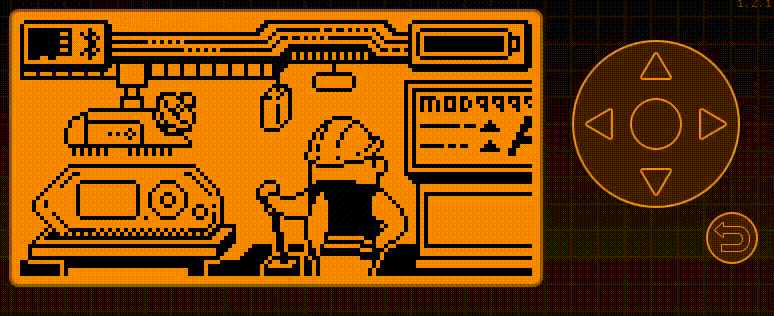

# flipperzero-i2ctools

**Maintainer**: [**AJ_60**](https://github.com/AJ60)  
**Repository**: [https://github.com/AJ60/Flipper_OLED_PCF8574_PN532](https://github.com/AJ60/Flipper_OLED_PCF8574_PN532)

---

Set of i2c tools for Flipper Zero

## Wiring

C0 -> SCL

C1 -> SDA

GND -> GND

>/!\ Target must use 3v3 logic levels. If you not sure use an i2c isolator like ISO1541

## Tools

### Scanner

Look for i2c peripherals adresses

### Sniffer

Spy i2c traffic

### Sender

Send command to i2c peripherals and read result 

## TODO
- [ ] Kicad module
- [ ] Improve UI
- [ ] Refactor Event Management Code
- [ ] Add Documentation

## V2
- [ ] Read more than 2 bytes in sender mode
- [ ] Add 10-bits adresses support
- [ ] Test with rate > 100khz
- [ ] Save records (Sigrok compatible?)
- [ ] Play from files
- [ ] Remove max data size
- [ ] Remove max frames read size