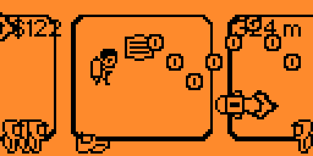

# flipper-jetpack-game

**Maintainer**: [**AJ_60**](https://github.com/AJ60)  
**Repository**: [https://github.com/AJ60/Flipper_OLED_PCF8574_PN532](https://github.com/AJ60/Flipper_OLED_PCF8574_PN532)

---

`JETPACKS, ROCKETS, AND ADVENTURE AWAITS!`

## Game Remake of Jetpack Joyride for Flipper Zero
- Recreated based on the classic Jetpack Joyride game for Flipper Zero.
- Get ready for a thrilling ride filled with obstacles, coins, and of course, jetpacks!

### Usage

- Start the "Jetpack Game" plugin and navigate Barry through the lab with your jetpack.

### Build

- Recursively clone your base firmware (official or not).
- Clone this repository in `applications_user`.
- Build with `./fbt fap_dist APPSRC=applications_user/flipper-jetpack-game`.
- Retrieve the built fap in the dist subfolders.

For more information about the build tool, check [here](https://github.com/AJ60/Flipper_OLED_PCF8574_PN532/blob/main/documentation/fbt.md).

### Credits

- Original Game: Jetpack Joyride by Halfbrick Studios.

---

Feel free to raise an issue or contribute to the project! Your feedback helps make the game better for everyone.
