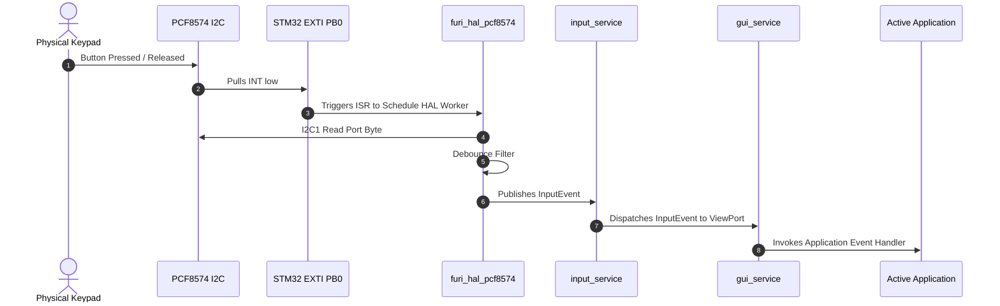
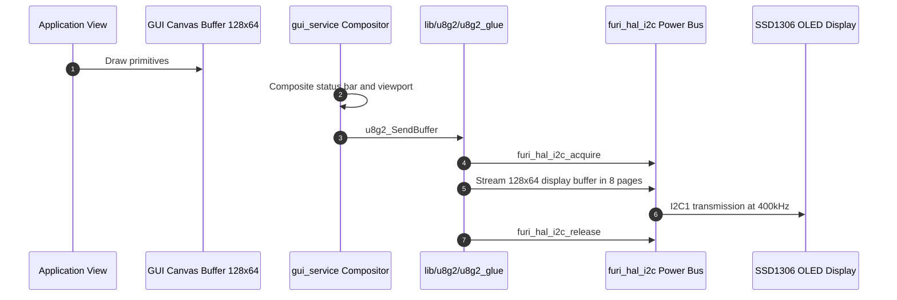
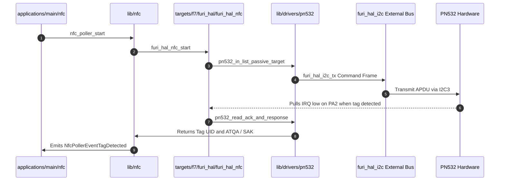

# 🧠 Agent Handover Knowledge Graph — DIY Flipper Zero (OLED Edition)

**Target Agent**: Hermes / Successor Agent  
**Repository**: [`Flipper_OLED_PCF8574_PN532`](https://github.com/AJ60/Flipper_OLED_PCF8574_PN532)  
**Hardware Target**: WeAct STM32WB55CGU6 (Dual-Core: Cortex-M4 @ 64MHz + Cortex-M0+ @ 32MHz)  
**Firmware Base**: Momentum Firmware (v2.2) with custom DIY hardware HAL adaptations  

---

## 1. Global System Knowledge Graph (Ontology & Topology)

```mermaid
graph TD
    subgraph HW_Layer ["Hardware Layer"]
        MCU["STM32WB55CGU6 MCU"]
        OLED["SSD1306 / SH1106 OLED"]
        PCF["PCF8574 Keypad & Vibro"]
        INA["INA219 / INA226 Fuel Gauge"]
        PN532["PN532 NFC Module"]
        CC1101["CC1101 Sub-GHz Radio"]
        RFID_TANK["125kHz LF-RFID LC Tank"]
        SD_CARD["MicroSD Card Module"]
        BUZZER["Piezo Buzzer"]
        IR_DIODES["Infrared TX / RX"]
    end

    subgraph Bus_Routing ["Bus & Interconnect Subsystem"]
        I2C1["I2C1 Power Bus - 400kHz - PA9 SCL / PB9 SDA"]
        I2C3["I2C3 External Bus - 400kHz - PA7 SCL / PB4 SDA"]
        SPI1["SPI1 Shared Bus - PB3 SCK / PB5 MOSI / PA6 MISO"]
        EXTI_BUS["EXTI Interrupt Lines - PB0, PB1, PA2, PA1"]
    end

    subgraph HAL_Layer ["FURI Hardware Abstraction Layer"]
        HAL_I2C["furi_hal_i2c"]
        HAL_OLED["lib/u8g2/u8g2_glue"]
        HAL_PCF["furi_hal_pcf8574"]
        HAL_INA["furi_hal_ina219"]
        HAL_NFC["furi_hal_nfc & pn532"]
        HAL_SUBGHZ["furi_hal_subghz & cc1101"]
        HAL_RFID["furi_hal_rfid"]
        HAL_SD["furi_hal_sd"]
        HAL_POWER["furi_hal_power"]
        HAL_LIGHT["furi_hal_light"]
        HAL_SPEAKER["furi_hal_speaker"]
    end

    subgraph OS_Kernel ["FURI OS & FreeRTOS Kernel"]
        FREERTOS["FreeRTOS Kernel Scheduler"]
        FURI_CORE["FURI Core Primitives - Threads, Mutex, PubSub"]
        FURI_RECORDS["FURI Service Registry"]
    end

    subgraph Services_Layer ["Background OS Services"]
        SVC_GUI["GUI Service - Display Pipeline & Canvas"]
        SVC_INPUT["Input Service - Keypad Debounce & Events"]
        SVC_POWER["Power Service - Battery Monitor & Sleep"]
        SVC_STORAGE["Storage Service - FatFS & SD I/O"]
        SVC_NOTIFICATION["Notification Service - Sounds & LEDs"]
        SVC_LOADER["Loader Service - App Launcher & FAP Manager"]
        SVC_DESKTOP["Desktop Service - Dolphin Mascot & Home"]
        SVC_BT["Bluetooth Service - BLE Peripheral & Serial"]
    end

    subgraph App_Ecosystem ["Application Suites"]
        APP_MAIN["Main Apps - NFC, Sub-GHz, RFID, IR, BadUSB"]
        APP_SETTINGS["Settings Apps - System, Power, Display"]
        APP_DEBUG["Debug Apps - 27 Diagnostic Tools"]
        APP_EXTERNAL["228+ External SD Applications .fap"]
    end

    %% Hardware to Bus Connections
    MCU --> I2C1
    MCU --> I2C3
    MCU --> SPI1
    MCU --> EXTI_BUS

    I2C1 --> OLED
    I2C1 --> PCF
    I2C1 --> INA
    I2C3 --> PN532
    SPI1 --> CC1101
    SPI1 --> SD_CARD
    EXTI_BUS --> PCF
    EXTI_BUS --> INA
    EXTI_BUS --> PN532
    EXTI_BUS --> CC1101

    %% Bus to HAL Connections
    I2C1 --> HAL_I2C
    I2C3 --> HAL_NFC
    SPI1 --> HAL_SUBGHZ
    SPI1 --> HAL_SD
    HAL_I2C --> HAL_OLED
    HAL_I2C --> HAL_PCF
    HAL_I2C --> HAL_INA

    %% HAL to OS Kernel
    HAL_OLED --> FURI_CORE
    HAL_PCF --> FURI_CORE
    HAL_INA --> FURI_CORE
    HAL_NFC --> FURI_CORE
    HAL_SUBGHZ --> FURI_CORE
    HAL_RFID --> FURI_CORE
    HAL_SD --> FURI_CORE
    FREERTOS --> FURI_CORE
    FURI_CORE --> FURI_RECORDS

    %% OS Kernel to Services
    FURI_RECORDS --> SVC_GUI
    FURI_RECORDS --> SVC_INPUT
    FURI_RECORDS --> SVC_POWER
    FURI_RECORDS --> SVC_STORAGE
    FURI_RECORDS --> SVC_NOTIFICATION
    FURI_RECORDS --> SVC_LOADER
    FURI_RECORDS --> SVC_DESKTOP
    FURI_RECORDS --> SVC_BT

    %% Services to Applications
    SVC_GUI --> APP_MAIN
    SVC_INPUT --> APP_MAIN
    SVC_STORAGE --> APP_MAIN
    SVC_LOADER --> APP_EXTERNAL
    SVC_GUI --> APP_SETTINGS
    SVC_GUI --> APP_DEBUG
```

---

## 2. Pin Routing & Peripheral Matrix (Authoritative Ground Truth)

| Peripheral Function | Physical Hardware Module | Actual MCU Pin | Port / Pin Macro | Header Label | Bus & Properties |
|---|---|---|---|---|---|
| **I2C1 Clock (SCL)** | SSD1306/SH1106 OLED, PCF8574, INA219 | `PA9` | `I2C_1_SCL_Pin` / `GPIOA` | *Internal* | Shared I2C1 @ 400 kHz |
| **I2C1 Data (SDA)** | SSD1306/SH1106 OLED, PCF8574, INA219 | `PB9` | `I2C_1_SDA_Pin` / `GPIOB` | *Internal* | Shared I2C1 @ 400 kHz |
| **Keypad Interrupt** | PCF8574 Expander INT | `PB0` | `PCF_INT_Pin` / `GPIOB` | *Internal* | EXTI0 (Falling Edge) |
| **Fuel Gauge Alert** | INA219 / INA226 Alert | `PB1` | `INA_ALERT_Pin` / `GPIOB` | *Internal* | EXTI1 |
| **I2C3 Clock (SCL)** | PN532 NFC Module | `PA7` | `I2C_3_SCL_Pin` / `GPIOA` | `C0` (Pin 16) | Dedicated I2C3 @ 400 kHz |
| **I2C3 Data (SDA)** | PN532 NFC Module | `PB4` | `I2C_3_SDA_Pin` / `GPIOB` | `C1` (Pin 15) | Dedicated I2C3 @ 400 kHz |
| **NFC Interrupt** | PN532 IRQ | `PA2` | `NFC_IRQ_Pin` / `GPIOA` | `A2` (Pin 4) | EXTI2 (Active Low) |
| **SPI1 Clock (SCK)** | MicroSD & CC1101 | `PB3` | `SPI_SCK_Pin` / `GPIOB` | `B3` (Pin 5) | Shared SPI1 (up to 32MHz) |
| **SPI1 MOSI** | MicroSD & CC1101 | `PB5` | `SPI_MOSI_Pin` / `GPIOB` | `A7` (Pin 2) | Shared SPI1 |
| **SPI1 MISO** | MicroSD & CC1101 | `PA6` | `SPI_MISO_Pin` / `GPIOA` | `A6` (Pin 3) | Shared SPI1 |
| **MicroSD CS** | MicroSD Card Adapter | `PA10` | `SD_CS_Pin` / `GPIOA` | *Internal* | Active Low |
| **MicroSD CD** | MicroSD Card Detect | `PC0` | `SD_CD_Pin` / `GPIOC` | *Internal* | Low = Card Inserted |
| **CC1101 Radio CS** | CC1101 Sub-GHz Module | `PA15` | `CC1101_CS_Pin` / `GPIOA` | *Internal* | Active Low |
| **CC1101 GDO0** | CC1101 Sub-GHz Module | `PA1` | `CC1101_G0_Pin` / `GPIOA` | *Internal* | EXTI1 (Shared with LF-RFID RX) |
| **LF-RFID Carrier** | 125 kHz LC Resonant Tank | `PA5` | `PC3_Pin` / `GPIOA` | `C3` (Pin 7) | TIM2_CH1 (125 kHz PWM) |
| **LF-RFID Demod/RX** | Envelope Detector Circuit | `PA1` | `CC1101_G0_Pin` / `GPIOA` | *Internal* | ADC1_IN6 / Comparator |
| **LF-RFID Pull/Emul** | Discrete Pull Transistor | `PA2` | `NFC_IRQ_Pin` / `GPIOA` | `A2` (Pin 4) | Shared with NFC IRQ |
| **Piezo Buzzer** | Passive Piezo Buzzer | `PB8` | `SPEAKER_Pin` / `GPIOB` | *Internal* | TIM4_CH3 PWM Audio Output |
| **Infrared TX** | IR LED Transistor Driver | `PA8` | `IR_TX_Pin` / `GPIOA` | *Internal* | TIM1_CH1 (38 kHz Carrier) |
| **Infrared RX** | TSOP / IR Demodulator | `PA0` | `IR_RX_Pin` / `GPIOA` | *Internal* | TIM2_CH1 Input Capture |
| **1-Wire / iButton** | Dallas / Cyfral / Metakom | `PA3` | `iBTN_Pin` / `GPIOA` | `iButton` (Pin 17)| Open-Drain with Pull-up |
| **UART Console TX** | CLI / Serial Shell | `PB6` | `USART1_TX_Pin` / `GPIOB` | `TX` (Pin 13) | USART1 @ 230400 8N1 |
| **UART Console RX** | CLI / Serial Shell | `PB7` | `USART1_RX_Pin` / `GPIOB` | `RX` (Pin 14) | USART1 @ 230400 8N1 |
| **SWD Debug Clock** | SWD Flash / Debugger | `PA14` | `SWCLK` | `SWC` (Pin 10) | SWD Interface |
| **SWD Debug Data** | SWD Flash / Debugger | `PA13` | `SWDIO` | `SWD` (Pin 12) | SWD Interface |

---

## 3. Subsystem Interaction & Dataflow Knowledge Graphs

### A. Input Processing Pipeline

### B. Display Rendering Pipeline

### C. NFC Reader Pipeline (PN532 over I2C3)

---

## 4. Key Source Code File Locations

* **Pin Mapping & HAL**: [`targets/f7/furi_hal/furi_hal_resources.c`](file:///c:/Users/alojy/OneDrive/Desktop/Flipper-OLED-Indian/oled_flipper/Flipper_OLED_PCF8574_PN532/targets/f7/furi_hal/furi_hal_resources.c) & [`furi_hal_resources.h`](file:///c:/Users/alojy/OneDrive/Desktop/Flipper-OLED-Indian/oled_flipper/Flipper_OLED_PCF8574_PN532/targets/f7/furi_hal/furi_hal_resources.h)
* **Keypad Driver**: [`targets/f7/furi_hal/furi_hal_pcf8574.c`](file:///c:/Users/alojy/OneDrive/Desktop/Flipper-OLED-Indian/oled_flipper/Flipper_OLED_PCF8574_PN532/targets/f7/furi_hal/furi_hal_pcf8574.c)
* **Battery Fuel Gauge**: [`targets/f7/furi_hal/furi_hal_ina219.c`](file:///c:/Users/alojy/OneDrive/Desktop/Flipper-OLED-Indian/oled_flipper/Flipper_OLED_PCF8574_PN532/targets/f7/furi_hal/furi_hal_ina219.c)
* **NFC HAL & Driver**: [`targets/f7/furi_hal/furi_hal_nfc.c`](file:///c:/Users/alojy/OneDrive/Desktop/Flipper-OLED-Indian/oled_flipper/Flipper_OLED_PCF8574_PN532/targets/f7/furi_hal/furi_hal_nfc.c) & [`lib/drivers/pn532.c`](file:///c:/Users/alojy/OneDrive/Desktop/Flipper-OLED-Indian/oled_flipper/Flipper_OLED_PCF8574_PN532/lib/drivers/pn532.c)
* **OLED Driver**: [`lib/u8g2/u8g2_glue.c`](file:///c:/Users/alojy/OneDrive/Desktop/Flipper-OLED-Indian/oled_flipper/Flipper_OLED_PCF8574_PN532/lib/u8g2/u8g2_glue.c)
* **Sub-GHz Driver**: [`targets/f7/furi_hal/furi_hal_subghz.c`](file:///c:/Users/alojy/OneDrive/Desktop/Flipper-OLED-Indian/oled_flipper/Flipper_OLED_PCF8574_PN532/targets/f7/furi_hal/furi_hal_subghz.c) & [`lib/drivers/cc1101.c`](file:///c:/Users/alojy/OneDrive/Desktop/Flipper-OLED-Indian/oled_flipper/Flipper_OLED_PCF8574_PN532/lib/drivers/cc1101.c)
* **LF-RFID Driver**: [`targets/f7/furi_hal/furi_hal_rfid.c`](file:///c:/Users/alojy/OneDrive/Desktop/Flipper-OLED-Indian/oled_flipper/Flipper_OLED_PCF8574_PN532/targets/f7/furi_hal/furi_hal_rfid.c)
* **Build System**: [`SConstruct`](file:///c:/Users/alojy/OneDrive/Desktop/Flipper-OLED-Indian/oled_flipper/Flipper_OLED_PCF8574_PN532/SConstruct), [`firmware.scons`](file:///c:/Users/alojy/OneDrive/Desktop/Flipper-OLED-Indian/oled_flipper/Flipper_OLED_PCF8574_PN532/firmware.scons), and [`fbt_options.py`](file:///c:/Users/alojy/OneDrive/Desktop/Flipper-OLED-Indian/oled_flipper/Flipper_OLED_PCF8574_PN532/fbt_options.py)

---

## 5. Critical Engineering Gotchas & Agent Rules

1. **Header Labels vs MCU Pins**:
   - Header **`C0`** = MCU **`PA7`** (I2C3 SCL).
   - Header **`C1`** = MCU **`PB4`** (I2C3 SDA).
   - Header **`A7`** = MCU **`PB5`** (SPI1 MOSI).
   - Header **`C3`** = MCU **`PA5`** (125 kHz RFID Carrier).
2. **Bus Locking**:
   - Always wrap shared I2C1 transactions with `furi_hal_i2c_acquire()` and `furi_hal_i2c_release()`.
   - Never activate both MicroSD CS (`PA10`) and CC1101 CS (`PA15`) concurrently.
3. **Pin Concurrency Conflicts**:
   - `PA1` is shared between CC1101 GDO0 and LF-RFID Data. Do not run Sub-GHz and RFID simultaneously.
   - `PA2` is shared between PN532 IRQ and LF-RFID Pull.
