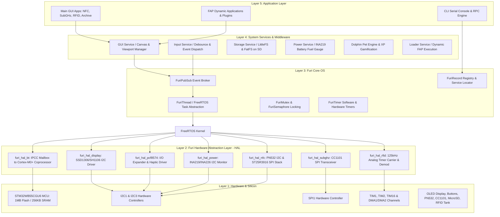
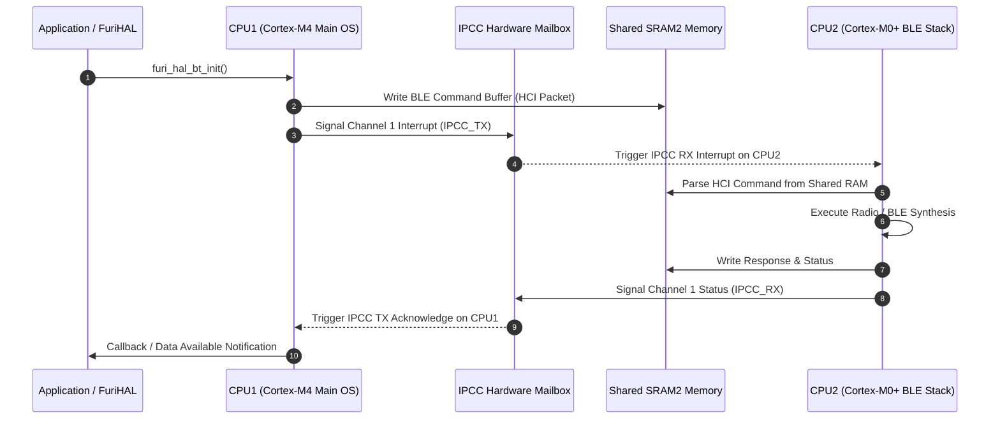

# 🏛️ System & Firmware Architecture: DIY Flipper Zero (OLED Edition)

**Target MCU**: STM32WB55CGU6 (ARM Cortex-M4 @ 64 MHz + ARM Cortex-M0+ @ 32 MHz)  
**RTOS**: FreeRTOS Kernel v10.5.1  
**Framework**: Furi OS & Furi HAL  
**Maintainer**: [**AJ_60**](https://github.com/AJ60)

---

## 1. High-Level Multi-Layer System Stack

The firmware is structured into modular layers designed for deterministic real-time execution, robust hardware abstraction, and event-driven application flow.

---

## 2. Dual-Core Inter-Processor Communication (IPC)

The STM32WB55 uses an asymmetric dual-core architecture:
1. **CPU1 (ARM Cortex-M4 @ 64 MHz)**: Runs the main user application, GUI rendering, FreeRTOS kernel, file system, and peripheral drivers.
2. **CPU2 (ARM Cortex-M0+ @ 32 MHz)**: Dedicated RF coprocessor running STMicroelectronics proprietary BLE stack and 2.4 GHz physical layer.

---

## 3. FreeRTOS Task Scheduling & Priority Matrix

Each system service operates in its own deterministic thread context with configured priorities:

| Task Name | Priority | Stack Size | Role / Description |
|---|---|---|---|
| **`GuiService`** | `FuriPriorityNormal` (24) | 4096 bytes | Dispatches canvas drawing commands, manages window viewports, flushes display buffer. |
| **`InputService`** | `FuriPriorityHigh` (36) | 2048 bytes | Handles PCF8574 interrupt lines (`PB0`), samples keypad state, performs 2-tick debouncing. |
| **`StorageService`** | `FuriPriorityBelowNormal` (16) | 4096 bytes | Handles SD card FatFS filesystem access over SPI1 bus with file mutex locking. |
| **`PowerService`** | `FuriPriorityBelowNormal` (16) | 2048 bytes | Queries INA219/INA226 voltage/current, calculates battery curves, handles low-power alerts. |
| **`NotificationService`** | `FuriPriorityLow` (12) | 1536 bytes | Manages vibration motor rumbling, LED backlights, and speaker tone sequences. |
| **`BtService`** | `FuriPriorityHigh` (36) | 2048 bytes | Manages Bluetooth Low Energy pairing, serial over BLE (CDC), and remote control. |
| **`LoaderService`** | `FuriPriorityNormal` (24) | 4096 bytes | Loads and dynamically links `.fap` application binaries from the microSD card into SRAM. |

---

## 4. Furi Core OS Primitive Model

The Furi OS framework provides thread-safe abstractions over low-level RTOS constructs:

1. **`FuriPubSub`**: Single-publisher, multi-subscriber event pipeline used for asynchronous decoupled messages (e.g. `InputEvent`, `BatteryEvent`).
2. **`FuriRecord`**: Thread-safe global service locator and dependency injection container (e.g. `furi_record_open(RECORD_GUI)`).
3. **`FuriMutex` / `FuriSemaphore`**: Mutual exclusion locks with priority inheritance to prevent priority inversions on shared hardware buses (I2C1, SPI1).
4. **`FuriThread`**: Encapsulates FreeRTOS tasks with memory-safe initialization, lifecycle callbacks, and signal flag mechanisms.
