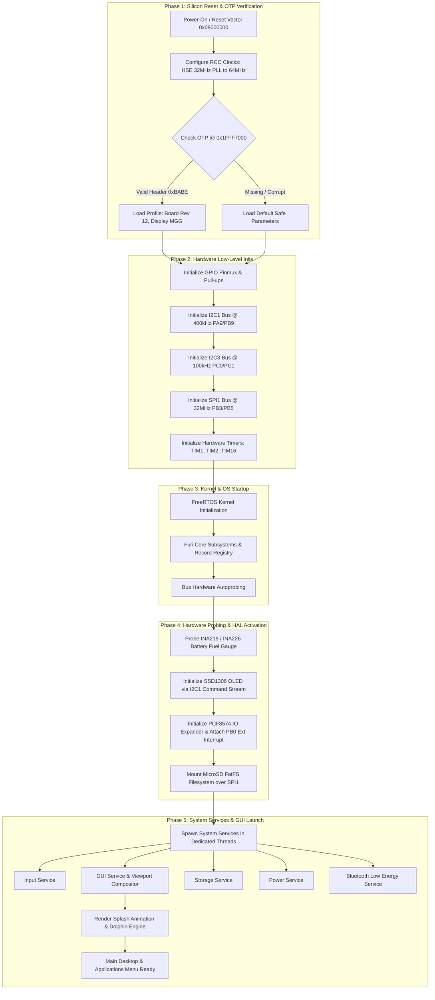
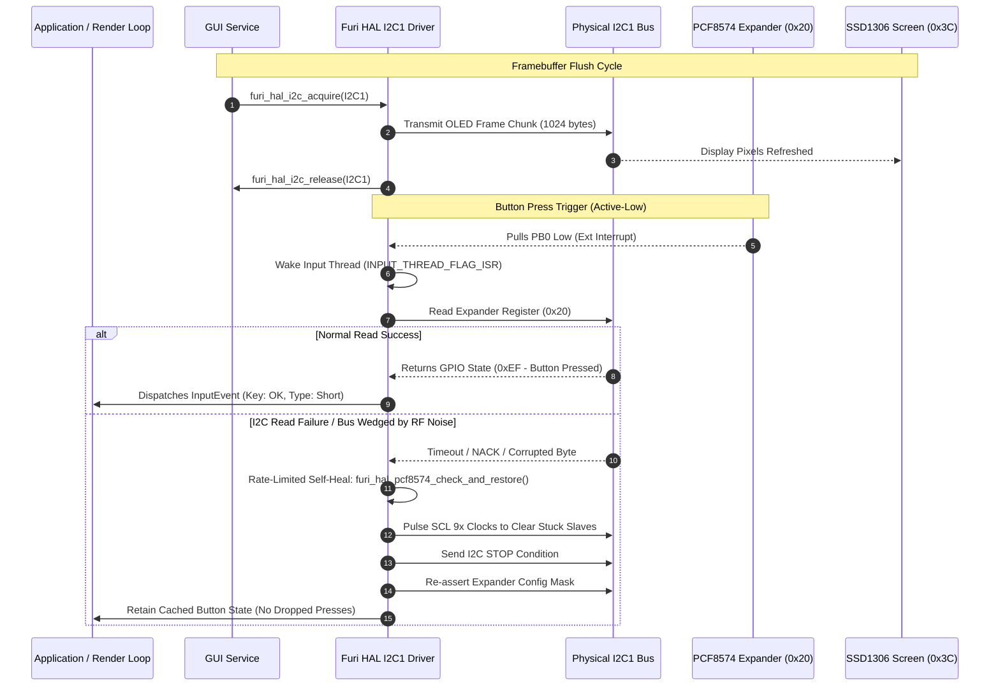
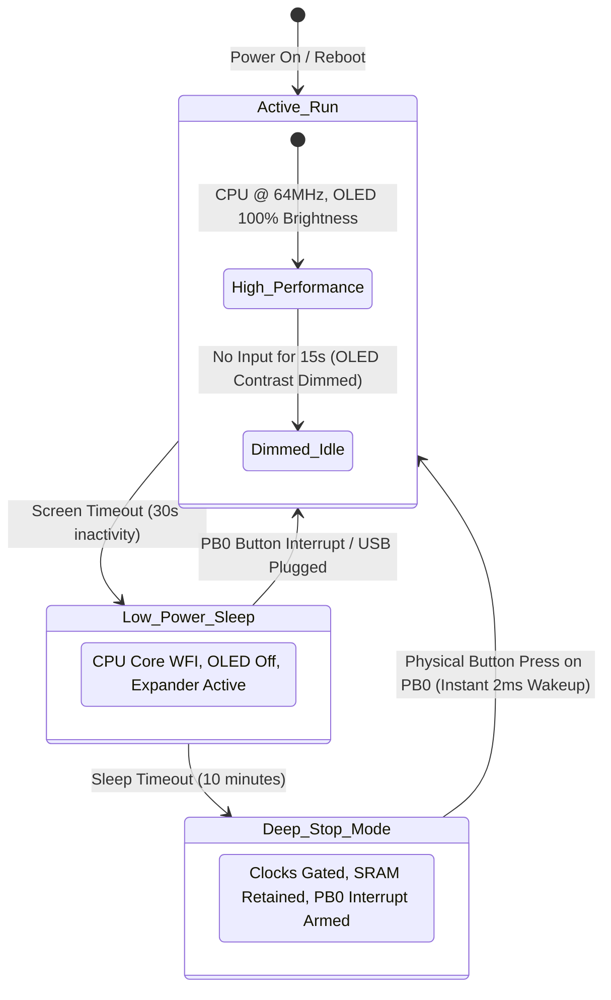

# 🌊 Firmware Boot & System Lifecycle: DIY Flipper Zero (OLED Edition)

**Target MCU**: STM32WB55CGU6  
**Maintainer**: [**AJ_60**](https://github.com/AJ60)

---

## 1. System Boot & Initialization Waterfall

The power-on sequence transitions from raw silicon reset through hardware validation, kernel activation, bus arbitration, and user-space service launch.

---

## 2. I2C Bus Arbitration & Rate-Limited Self-Healing Waterfall

Because the SSD1306 display, PCF8574 keypad, and INA219/INA226 power monitor share the single I2C1 bus, an arbitration and recovery mechanism ensures bus lockups never freeze the device.

---

## 3. Power State Transitions & Fast Wake Machine

The firmware supports intelligent power state transitions to maximize battery runtime:

