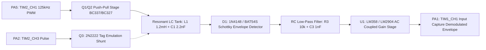

# 📐 Hardware & Electrical Engineering Guide: DIY Flipper Zero (OLED Edition)

**Target MCU**: STM32WB55CGU6 (UFQFPN48 package)  
**Maintainer**: [**AJ_60**](https://github.com/AJ60)

---

## 1. Complete Pinout & Bus Mapping Matrix


---

## 2. 125 kHz LF-RFID Analog Signal Chain

The LF-RFID subsystem uses a discrete analog front-end driven directly by hardware timer PWM and sampled via input capture:



### Resonant Tank Calculation:
$$f_0 = \frac{1}{2 \pi \sqrt{L \cdot C}} = \frac{1}{2 \pi \sqrt{1.2 \times 10^{-3} \cdot 2.2 \times 10^{-9}}} \approx 125.02\text{ kHz}$$

---

## 3. I2C Bus Coexistence & Pull-Up Engineering

The primary `I2C1` bus multiplexes three active peripherals:
1. **SSD1306 / SH1106 OLED Display** (7-bit address `0x3C`)
2. **PCF8574 Keypad & Haptic Expander** (7-bit address `0x20`)
3. **INA219 / INA226 Battery Fuel Gauge** (7-bit address `0x40`)

```
   3.3V Rail
      │
      ├───[ 2.2 kΩ R_pullup ]───┐
      │                         │
      ├───[ 2.2 kΩ R_pullup ]───┼───────────┐
      │                         │           │
     GND                        │           │
      │                        SCL         SDA
      ▼                       (PA9)       (PB9)
                                │           │
  ┌─────────────────────────────┼───────────┼────────────────────────┐
  │                             │           │                        │
  │   ┌───────────────┐         │           │   ┌────────────────┐   │
  │   │ SSD1306 OLED  │─────────┴───────────┼───│ PCF8574 Expander│  │
  │   │ (Addr: 0x3C)  │                     │   │ (Addr: 0x20)   │   │
  │   └───────────────┘                     │   └──────┬─────────┘   │
  │                                         │          │             │
  │                                         │          ▼             │
  │   ┌───────────────┐                     │        PB0 INT         │
  │   │ INA219 Monitor│─────────────────────┘      (Ext Interrupt)   │
  │   │ (Addr: 0x40)  │                                              │
  │   └───────┬───────┘                                              │
  │           │                                                      │
  │           ▼                                                      │
  │        PB1 ALERT                                                 │
  │     (Power Alert)                                                │
  └──────────────────────────────────────────────────────────────────┘
```

> [!TIP]
> **Total Bus Capacitance & Noise Immunity**:
> Standard jumper wires add ~15–30 pF capacitance per node. Adding physical **2.2 kΩ or 3.3 kΩ external pull-ups** ensures fast rise times (<300 ns) at 400 kHz fast-mode I2C and provides robust RF noise immunity during Sub-GHz and NFC transmissions.

---

## 4. Power Decoupling & Filtering Guidelines

To ensure stable operation under peak RF loads:
* Solder a **0.1 µF (100 nF)** ceramic capacitor directly across the `VCC` and `GND` pins of the **PCF8574** expander.
* Solder a **10 µF** tantalum or electrolytic capacitor across the 3.3V power rail near the **CC1101** module to absorb RF power amplifier surges.
* Ensure all ground lines return directly to the WeAct board's `GND` ground plane (star ground topology).
