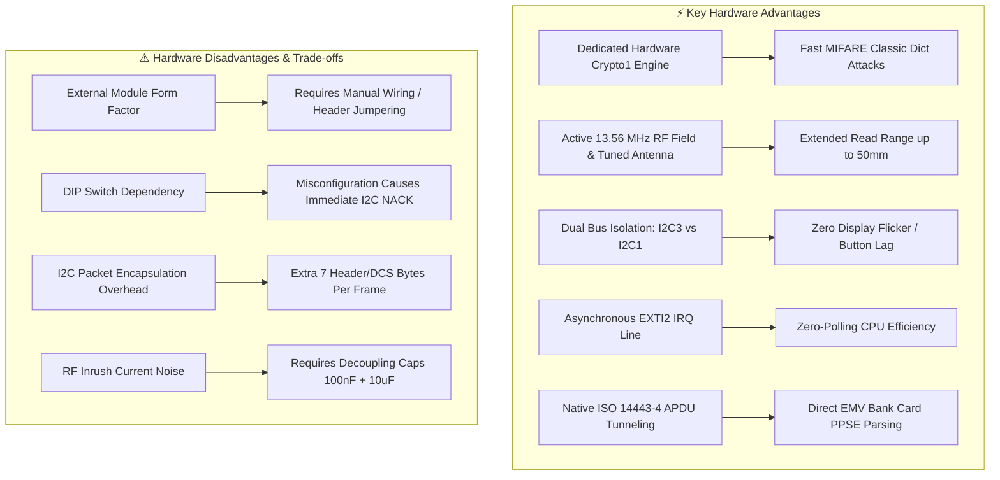
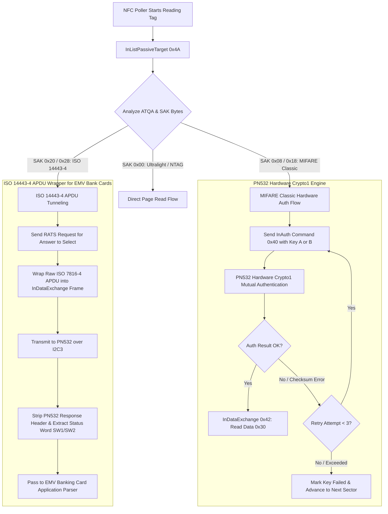
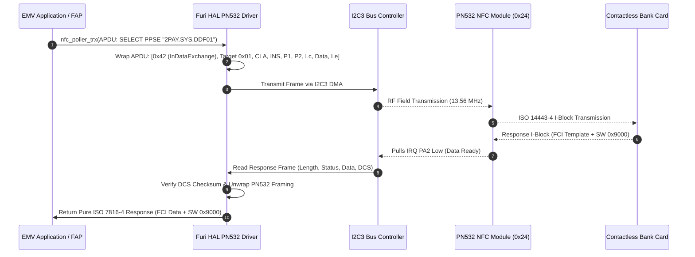

# ⚡ PN532 NFC Protocol & Hardware Acceleration Engineering — DIY Flipper Zero (OLED Edition)

**Component**: NXP PN532 Near Field Communication Controller over Dedicated Hardware I2C3  
**Bus / Interface**: I2C3 (SCL: `PA7`, SDA: `PB4`, IRQ: `PA2`)  
**Maintainer**: [**AJ_60**](https://github.com/AJ60)  
**Repository**: [https://github.com/AJ60/Flipper_OLED_PCF8574_PN532](https://github.com/AJ60/Flipper_OLED_PCF8574_PN532)  
**Status**: 🚧 **Under Active Development / Experimental**

---

> [!CAUTION]
> ⚖️ **EDUCATIONAL & RESEARCH USE ONLY**:
> This document and the associated NFC drivers are provided strictly for educational purposes, cryptographic research, and authorized personal testing. Any unauthorized interception, card cloning, or unlawful activities are strictly prohibited. The author assumes no liability for misuse.

> [!NOTE]
> **Tested & Verified NFC Hardware Target Scope**:
> - ✅ **MIFARE Classic 1K / 4K**: Hardware Crypto1 cipher acceleration and dictionary attack parsing.
> - ✅ **NTAG Series (NTAG213, NTAG215, NTAG216, Ultralight)**: Direct page reading and standard NDEF dumps.
> - ✅ **Contactless EMV Bank / ATM Payment Cards**: ISO 14443-4 APDU wrapping and PPSE application selection.
> - ⚠️ Other proprietary transponders or card types are experimental and under ongoing development.

---

## 1. Hardware Overview & Pin Configuration

The DIY Flipper Zero (OLED Edition) connects an external **NXP PN532 NFC module** via the STM32WB55's dedicated **I2C3 hardware bus** rather than sharing the I2C1 display/keypad bus. This dual-bus architecture prevents display flicker and keypad input lag during intensive NFC scanning.

```
       WeAct STM32WB55CGU6                     NXP PN532 NFC Module
     ┌──────────────────────┐                 ┌──────────────────────┐
     │                      │                 │                      │
     │            PA7 (C0) ├─────────────────┤ SCL                  │
     │            PB4 (C1) ├─────────────────┤ SDA                  │
     │                 PA2  ├─────────────────┤ IRQ / INT0           │
     │                 3.3V ├─────────────────┤ VCC                  │
     │                  GND ├─────────────────┤ GND                  │
     │                      │                 │                      │
     │                      │                 │  DIP Switch: [0, 1]  │
     │                      │                 │  Mode: I2C Bus       │
     └──────────────────────┘                 └──────────────────────┘
```

### 📌 Electrical Pinout Matrix

| Module Pin | MCU Pin | Board Header Label | Direction | Description |
| --- | --- | --- | --- | --- |
| **VCC** | `3.3V` / `5V` | `3V3` / `5V` | Power IN | Power supply (3.3V DC recommended; 5V supported if module has onboard LDO) |
| **GND** | `GND` | `G` | Ground | Common system ground reference |
| **SCL** | `PA7` | **`C0`** | Bidirectional | I2C3 Clock line (requires 4.7 kΩ pull-up to 3.3V if not present on breakout) |
| **SDA** | `PB4` | **`C1`** | Bidirectional | I2C3 Data line (requires 4.7 kΩ pull-up to 3.3V if not present on breakout) |
| **IRQ / INT0** | `PA2` | **`A2`** | Input (from PN532) | Active-Low Data Ready Interrupt (triggers `EXTI2` on STM32WB55) |
| **RSTPD_N** | -- | -- | Input (to PN532) | Hardware Reset / Power Down (optional; pulled High to 3.3V on breakout) |

> [!IMPORTANT]
> **Silkscreen Header Labels on WeAct Board**:
> - Pin `PA7` is labeled **`C0`** on the development board pin header.
> - Pin `PB4` is labeled **`C1`** on the development board pin header.
> - Pin `PA2` is labeled **`A2`** on the development board pin header.

### 🎚️ PN532 DIP Switch Configuration (Interface Selection)

On standard red and blue PN532 breakout boards, the physical DIP switches must be configured for **I2C mode**:

| Switch 1 (`I0`) | Switch 2 (`I1`) | Selected Protocol | Status for this Firmware |
| --- | --- | --- | --- |
| **0 (OFF / Low)** | **1 (ON / High)** | **I2C** | ✅ **REQUIRED** |
| 1 (ON / High) | 0 (OFF / Low) | SPI | ❌ Not supported by current driver |
| 0 (OFF / Low) | 0 (OFF / Low) | HSU (High Speed UART) | ❌ Not supported by current driver |

---

## 2. The Critical Role of the IRQ Pin (`PA2`)

The **IRQ (Interrupt Request) pin** on `PA2` is a fundamental hardware component of this firmware's NFC architecture:

```
PN532 Controller                  STM32WB55 Core                  FreeRTOS Poller
      │                                 │                                │
      │ 1. RF Transaction Completes     │                                │
      │─────────────────────────┐       │                                │
      │ 2. Pulls IRQ (PA2) LOW  │       │                                │
      │─────────────────────────┼──────>│ 3. EXTI2 IRQ Fires             │
      │                         │       │───> furi_thread_flags_set()    │
      │                         │       │                                │
      │                         │       │ 4. Wakes Poller Thread ───────>│
      │                         │       │                                │
      │ 5. I2C3 Frame Readback  │<──────┼────────────────────────────────┤
      │<────────────────────────┴───────┼────────────────────────────────┤
      │ 6. Response Transmitted (Data)  │                                │
      │────────────────────────────────>│                                │
      │ 7. Pulls IRQ (PA2) HIGH (Idle)  │                                │
```

### Why the IRQ Pin is Essential:

1. **Zero-Overhead FreeRTOS Scheduling**:
   Instead of burning CPU cycles with continuous I2C polling loops (`while(!ready)`), the NFC worker thread yields execution and enters sleep mode via `furi_thread_flags_wait()`. The hardware `EXTI2` interrupt on `PA2` immediately wakes the thread when the PN532 finishes processing an RF transaction.

2. **Precise Cryptographic Timing**:
   MIFARE Classic hardware Crypto1 mutual authentication (`0x40 InAuth`) requires microsecond-accurate handshakes. The IRQ line alerts the MCU the exact moment the tag responds, eliminating timing jitter that causes authentication failures in software-polled setups.

3. **Prevention of I2C Bus Lockups**:
   Attempting to read from the PN532 before its internal Contactless Interface Unit (CIU) has populated the response FIFO can cause I2C NACKs or bus stretches. The IRQ handshake guarantees that a read is initiated **only when valid data is in the FIFO**.

4. **Power Efficiency**:
   When waiting for an NFC card to enter the RF field (`InListPassiveTarget`), the STM32WB55 core remains in low-power idle mode until a card triggers the PN532 RF detector and drops the IRQ line.

---

## 3. Advantages & Disadvantages of the PN532 Hardware Implementation



### ⚡ Advantages

* **Hardware Crypto1 Acceleration**:
  The PN532 features onboard silicon Crypto1 cipher acceleration. Unlike soft-crypto implementations, authentication keys are processed directly inside the PN532 hardware, allowing dictionary attacks at maximum speed without consuming MCU RAM or CPU time.

* **Superior Read Range & Field Strength**:
  PN532 breakout modules feature a matched inductive PCB antenna with high RF output power (up to 50 mm read distance), significantly outperforming tiny discrete coil antennas on compact DIY builds.

* **Dedicated I2C3 Bus Isolation**:
  By dedicating STM32WB55's **I2C3** to the PN532 and **I2C1** to the SSD1306 OLED, PCF8574 keypad, and INA219 power monitor, high-throughput NFC packet transfers never starve or glitch the display rendering pipeline.

* **Full ISO 14443-4 APDU Tunneling**:
  Native support for APDU exchange via `0x42 InDataExchange` allows direct interrogation of smart cards, EMV contactless bank cards (Visa, Mastercard, RuPay), and passport e-chips.

* **Multi-Protocol Versatility**:
  Supports ISO/IEC 14443 Type A, Type B, FeliCa, MIFARE Classic, Ultralight, DESFire, and NTAG series in a single integrated controller.

### ⚠️ Disadvantages & Limitations

* **External Module Wiring**:
  Unlike commercial devices with an integrated surface-mount transceiver (like the ST25R3916), the DIY build requires connecting an external breakout board via 5 jumper wires (`VCC`, `GND`, `SCL`, `SDA`, `IRQ`).

* **Protocol Framing Overhead**:
  Every command and response over I2C requires preamble, start code (`0x00 0xFF`), length, checksum (`LCS`), data bytes, data checksum (`DCS`), and postamble (`0x00`), adding 7 to 9 bytes of bus overhead per frame.

* **DIP Switch User Error**:
  Breakout modules shipped with DIP switches set to SPI or UART mode will fail I2C probing on startup. Users must manually verify physical switch positions (`0, 1`).

* **RF Inrush Noise on Shared 3.3V Rail**:
  When the PN532 activates its 13.56 MHz carrier wave, current draw spikes can induce ripple on the power rail if adequate decoupling capacitors (100 nF ceramic + 10 µF electrolytic/tantalum) are omitted.

---

## 4. Hardware Crypto1 Authentication Architecture



---

## 5. ISO 14443-4 APDU Protocol Frame Flow (EMV Cards)

To read contactless bank cards and payment tokens, APDUs are encapsulated through the PN532 without breaking ISO 7816-4 framing:



---

## 6. Communication Robustness & Error Recovery

### DCS Checksum Error Retry Loop
PN532 I2C communication in high RF fields can occasionally suffer from transient bit errors.

1. **3-Attempt InDataExchange Retry**: If a DCS checksum mismatch is detected, the driver automatically re-transmits the frame up to 3 times before declaring an error.
2. **CIU Reset on Consecutive Failures**: If 5 consecutive failures occur, the driver pulses the PN532 hardware reset line and re-initializes Contactless Interface Unit (CIU) registers.
3. **Dictionary Attack Early Abort**: If 10 consecutive hardware errors occur, the dictionary attack loop aborts immediately with a clear error prompt rather than locking the interface.

---

## 7. Card Type SAK & ATQA Identification Matrix

| SAK Byte | ATQA | Card Technology / Standard | Supported Operations |
| --- | --- | --- | --- |
| `0x08` | `0x0004` | **MIFARE Classic 1K** | Read, Write, Emulate, HW Crypto1 Dict Attack |
| `0x18` | `0x0002` | **MIFARE Classic 4K** | Read, Write, Emulate, 40 Sectors HW Auth |
| `0x09` | `0x0004` | **MIFARE Mini (0.3K)** | Read, Write, Emulate |
| `0x00` | `0x0044` | **MIFARE Ultralight / NTAG213/215/216** | Fast Read (Pages 0–44), Password Auth, NDEF Read/Write |
| `0x20` | `0x0344` | **MIFARE DESFire / ISO 14443-4** | APDU Exchange, Free Directory Traverse |
| `0x28` | `0x0048` | **JCOP / EMV Contactless Bank Cards** | ISO 7816-4 APDU Tunneling, PPSE Application Selection |

---

## 8. Hardware Diagnostics & Troubleshooting Guide

| Symptom | Probable Cause | Corrective Action |
| --- | --- | --- |
| **"PN532 not found" on boot** | DIP switches set to SPI or UART mode | Set DIP switches to **`0, 1`** (Switch 1 OFF, Switch 2 ON for I2C) |
| **I2C3 bus timeout / freeze** | Missing I2C pull-up resistors | Solder **4.7 kΩ pull-up resistors** between `PA7` (C0) -> 3.3V and `PB4` (C1) -> 3.3V |
| **NFC card detected but read hangs** | `PA2` IRQ pin disconnected or floating | Connect PN532 **`IRQ`** pin directly to MCU **`PA2`** (board header `A2`) |
| **Display flickers during NFC scan** | NFC wired to I2C1 instead of I2C3 | Ensure PN532 is wired to **`PA7`/`PB4`** (I2C3), NOT `PA9`/`PB9` (I2C1 OLED bus) |
| **Intermittent auth failures** | RF power ripple on 3.3V rail | Add a **100 nF ceramic capacitor** across PN532 `VCC` and `GND` right at the module header |
| **Checksum (DCS) errors in logs** | Jumper wire length too long (>15 cm) | Keep I2C jumper wires short (<10 cm) and twisted with a ground line |
