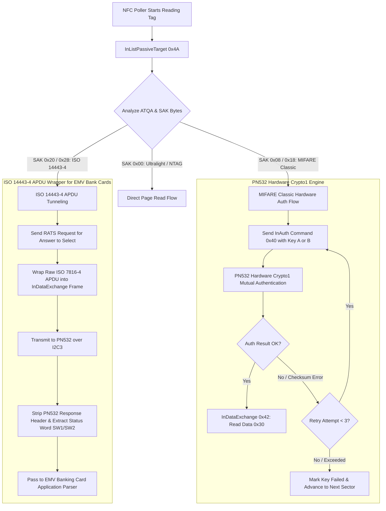
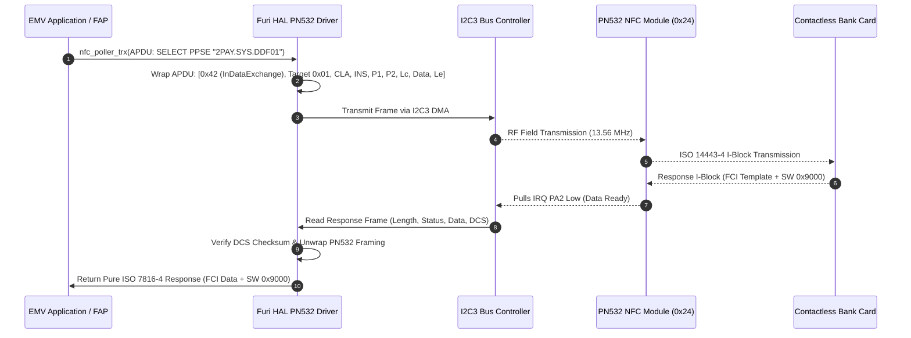

# ⚡ PN532 NFC Protocol & Hardware Acceleration Engineering: DIY Flipper Zero

**Component**: PN532 NFC Controller (NXP) over I2C3 (SCL: `PA7`, SDA: `PB4`, IRQ: `PA2`)  
**Maintainer**: [**AJ_60**](https://github.com/AJ60)  
**Status**: 🚧 **Under Active Development / Experimental**

> [!CAUTION]
> ⚖️ **EDUCATIONAL & RESEARCH USE ONLY**:
> This document and the associated NFC drivers are provided strictly for educational purposes, cryptographic research, and authorized personal testing. Any unauthorized interception, card cloning, or unlawful activities are strictly prohibited. The author assumes no liability for misuse.

> [!NOTE]
> **Tested & Verified NFC Hardware Target Scope**:
> - ✅ **MIFARE Classic 1K / 4K**: Tested with hardware Crypto1 acceleration and dictionary attack parsing.
> - ✅ **NTAG Series (NTAG213, NTAG215, NTAG216, Ultralight)**: Tested with direct page reading and standard NDEF dumps.
> - ✅ **Contactless EMV Bank / ATM Payment Cards**: Tested with ISO 14443-4 APDU wrapping and PPSE application selection.
> - ⚠️ Other proprietary transponders or card types are experimental and under ongoing development.

---

## 1. PN532 Hardware Crypto1 Authentication Architecture

Unlike standard software-emulated Crypto1 cipher implementations, this firmware interfaces directly with the PN532's onboard hardware crypto engine via the `InAuth` (Command `0x40`) and `InDataExchange` (Command `0x42`) primitives.

---

## 2. ISO 14443-4 APDU Protocol Frame Flow (EMV Cards)

To read modern contactless payment cards (Visa, Mastercard, RuPay, Amex) and government e-Passports, APDUs are tunneled through the PN532 without breaking ISO 7816-4 framing:

---

## 3. Communication Robustness & Error Recovery

### DCS Checksum Error Retry Loop:
PN532 I2C communication in high RF fields can occasionally suffer from transient checksum errors. Previously, a single corrupted byte caused an entire sector read to fail, triggering a wasteful 2,475-key dictionary attack timeout.

1. **3-Attempt InDataExchange Retry**: If a DCS checksum mismatch is detected, the driver automatically re-transmits the frame up to 3 times before declaring an error.
2. **CIU Reset on Consecutive Failures**: If 5 consecutive failures occur, the driver pulses the PN532 hardware reset line and re-initializes Contactless Interface Unit (CIU) registers.
3. **Dictionary Attack Early Abort**: If 10 consecutive hardware errors occur, the dictionary attack loop aborts immediately with a clear error prompt rather than freezing the screen for minutes.

---

## 4. Card Type SAK & ATQA Identification Matrix

| SAK Byte | ATQA | Card Technology / Standard | Supported Operations |
|---|---|---|---|
| `0x08` | `0x0004` | **MIFARE Classic 1K** | Read, Write, Emulate, HW Crypto1 Dict Attack |
| `0x18` | `0x0002` | **MIFARE Classic 4K** | Read, Write, Emulate, 40 Sectors HW Auth |
| `0x09` | `0x0004` | **MIFARE Mini (0.3K)** | Read, Write, Emulate |
| `0x00` | `0x0044` | **MIFARE Ultralight / NTAG213/215/216** | Fast Read (Pages 0–44), Password Auth, NDEF Read/Write |
| `0x20` | `0x0344` | **MIFARE DESFire / ISO 14443-4** | APDU Exchange, Free Directory Traverse |
| `0x28` | `0x0048` | **JCOP / EMV Contactless Bank Cards** | ISO 7816-4 APDU Tunneling, PPSE Application Selection |
